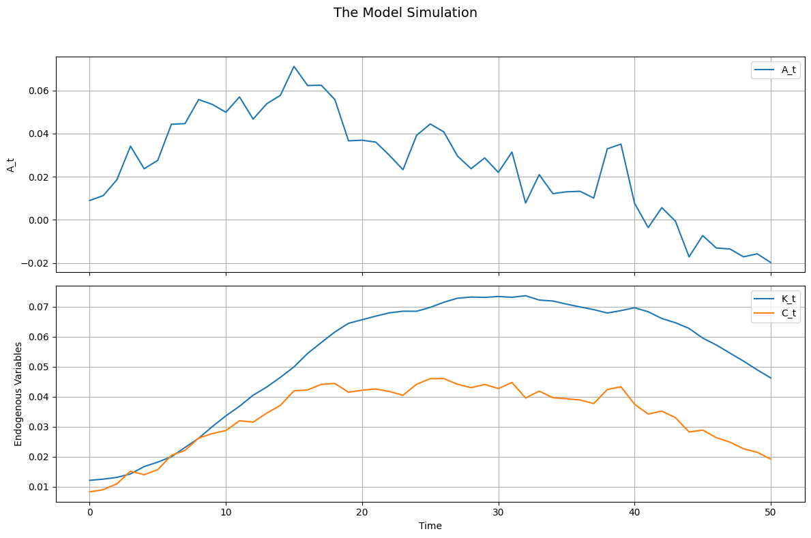

```python
from econometron.Models.dynamicsge import linear_dsge
```


```python
equations = [
    "-C_t**(-sigma) + beta * C_tp1**(-sigma) * (alpha * A_tp1 * K_tp1**(alpha-1) + 1 - delta) = 0",  # Euler equation
    "C_t + K_tp1 - A_t * K_t**alpha - (1 - delta) * K_t = 0",  # Capital accumulation
    "-log(A_tp1) + rho_a * log(A_t) + epsilon = 0",  # Technology shock process
]
```


```python
variables = ['A','K','C']  # Technology, Capital, Consumption
states = ['A','K']         # State variables: Technology and Capital
exo_states = ['A']         # Exogenous state: Technology
endo_states = ['K']        # Endogenous state: Capital
shocks = ['epsilon']       # Technology shock
parameters = {
    'sigma': 1.5,    # Risk aversion
    'beta': 0.99,    # Discount factor
    'alpha': 0.35,   # Capital share
    'delta': 0.025,  # Depreciation rate
    'rho_a': 0.9,    # Technology persistence
    'epsilon':0.01   # Std. dev. of technology shock
}
```


```python
initial_guess = [1,1]
```


```python
RBC = linear_dsge(
    equations=equations,
    variables=variables,
    exo_states=exo_states,
    endo_states=endo_states,
    shocks=shocks,
    parameters=parameters,
)
```


```python
RBC.set_initial_guess(initial_guess)
RBC.normalize={'A':1}
RBC.compute_ss(guess=initial_guess, method='fsolve', options={'xtol': 1e-8})
```

    Steady-state residuals: [-1.77851329e-13  9.03721542e-14 -1.00000000e-02]
    Warning: Large steady-state residuals detected.
    


    A     1.000000
    K    34.398226
    C     2.589794
    dtype: float64


```python
RBC._Analytical_jacobians(debug=True)
```

    Ordered variables: ['A', 'K', 'C']
    Substitution dictionary: {A_t: 1.0, A_tp1: 1.0, A_tm1: 1.0, K_t: 34.39822605103811, K_tp1: 34.39822605103811, K_tm1: 34.39822605103811, C_t: 2.58979429186702, C_tp1: 2.58979429186702, C_tm1: 2.58979429186702, epsilon: 0.01, epsilon_t: 0.0, sigma: 1.5, beta: 0.99, alpha: 0.35, delta: 0.025, rho_a: 0.9}
    
    Processing equation 0: -C_t**(-sigma) + beta * C_tp1**(-sigma) * (alpha * A_tp1 * K_tp1**(alpha-1) + 1 - delta) = 0
      tp1_terms: -A_tp1*K_tp1**(alpha - 1)*alpha*beta/C_tp1**sigma + beta*delta/C_tp1**sigma - beta/C_tp1**sigma
      t_terms: -1/C_t**sigma
      shock_terms: 0
    
    Processing equation 1: C_t + K_tp1 - A_t * K_t**alpha - (1 - delta) * K_t = 0
      tp1_terms: -K_tp1
      t_terms: -A_t*K_t**alpha + C_t + K_t*delta - K_t
      shock_terms: 0
    
    Processing equation 2: -log(A_tp1) + rho_a * log(A_t) + epsilon = 0
      tp1_terms: log(A_tp1)
      t_terms: rho_a*log(A_t)
      shock_terms: epsilon
    Equation to variable mapping: {0: 'A', 1: 'K', 2: 'C'}
    Reordering index: [0, 1, 2]
    Analytical Jacobian A (reordered):
     [[-8.33790428e-03  1.57555735e-04  1.38972249e-01]
     [ 0.00000000e+00 -1.00000000e+00  0.00000000e+00]
     [ 1.00000000e+00  0.00000000e+00  0.00000000e+00]]
    Analytical Jacobian B (reordered):
     [[ 0.          0.          0.13897225]
     [-3.44974994 -1.01010101  1.        ]
     [ 0.9         0.          0.        ]]
    Analytical Jacobian C (reordered):
     [[0.]
     [0.]
     [1.]]
    


    (array([[-8.33790428e-03,  1.57555735e-04,  1.38972249e-01],
            [ 0.00000000e+00, -1.00000000e+00,  0.00000000e+00],
            [ 1.00000000e+00,  0.00000000e+00,  0.00000000e+00]]),
     array([[ 0.        ,  0.        ,  0.13897225],
            [-3.44974994, -1.01010101,  1.        ],
            [ 0.9       ,  0.        ,  0.        ]]),
     array([[0.],
            [0.],
            [1.]]))


```python
RBC.approximate()
```


    (array([[-8.33790428e-03,  1.57555735e-04,  1.38972249e-01],
            [ 0.00000000e+00, -1.00000000e+00,  0.00000000e+00],
            [ 1.00000000e+00,  0.00000000e+00,  0.00000000e+00]]),
     array([[ 0.        ,  0.        ,  0.13897225],
            [-3.44974994, -1.01010101,  1.        ],
            [ 0.9       ,  0.        ,  0.        ]]),
     array([[0.],
            [0.],
            [1.]]))


```python
RBC.solve_RE_model()
print("Policy Function (f):\n", RBC.f)
print("State Transition (p):\n", RBC.p)
```

    Policy Function (f):
     [[0.59492193 0.03861978]]
    State Transition (p):
     [[0.9        0.        ]
     [2.85482802 0.97148123]]
    


```python
RBC.plot_irfs()
```


    

    


```python
import numpy as np
RBC.simulate(T=51, drop_first=10, covariance_matrix=np.array([[0.01**2]]))
```


<div>
<style scoped>
    .dataframe tbody tr th:only-of-type {
        vertical-align: middle;
    }

    .dataframe tbody tr th {
        vertical-align: top;
    }

    .dataframe thead th {
        text-align: right;
    }
</style>
<table border="1" class="dataframe">
  <thead>
    <tr style="text-align: right;">
      <th></th>
      <th>epsilon_t</th>
      <th>A_t</th>
      <th>K_t</th>
      <th>C_t</th>
    </tr>
  </thead>
  <tbody>
    <tr>
      <th>0</th>
      <td>-0.000490</td>
      <td>0.008993</td>
      <td>0.012128</td>
      <td>0.008287</td>
    </tr>
    <tr>
      <th>1</th>
      <td>0.003184</td>
      <td>0.011278</td>
      <td>0.012529</td>
      <td>0.009017</td>
    </tr>
    <tr>
      <th>2</th>
      <td>0.008467</td>
      <td>0.018617</td>
      <td>0.013107</td>
      <td>0.011000</td>
    </tr>
    <tr>
      <th>3</th>
      <td>0.017451</td>
      <td>0.034206</td>
      <td>0.014279</td>
      <td>0.015182</td>
    </tr>
    <tr>
      <th>4</th>
      <td>-0.007090</td>
      <td>0.023696</td>
      <td>0.016710</td>
      <td>0.014015</td>
    </tr>
    <tr>
      <th>5</th>
      <td>0.006313</td>
      <td>0.027639</td>
      <td>0.018200</td>
      <td>0.015685</td>
    </tr>
    <tr>
      <th>6</th>
      <td>0.019465</td>
      <td>0.044340</td>
      <td>0.019975</td>
      <td>0.020432</td>
    </tr>
    <tr>
      <th>7</th>
      <td>0.004734</td>
      <td>0.044640</td>
      <td>0.023085</td>
      <td>0.022096</td>
    </tr>
    <tr>
      <th>8</th>
      <td>0.015623</td>
      <td>0.055799</td>
      <td>0.026132</td>
      <td>0.026222</td>
    </tr>
    <tr>
      <th>9</th>
      <td>0.003339</td>
      <td>0.053558</td>
      <td>0.030018</td>
      <td>0.027701</td>
    </tr>
    <tr>
      <th>10</th>
      <td>0.001717</td>
      <td>0.049919</td>
      <td>0.033606</td>
      <td>0.028706</td>
    </tr>
    <tr>
      <th>11</th>
      <td>0.012094</td>
      <td>0.057020</td>
      <td>0.036791</td>
      <td>0.031971</td>
    </tr>
    <tr>
      <th>12</th>
      <td>-0.004581</td>
      <td>0.046737</td>
      <td>0.040474</td>
      <td>0.031498</td>
    </tr>
    <tr>
      <th>13</th>
      <td>0.011788</td>
      <td>0.053851</td>
      <td>0.043199</td>
      <td>0.034530</td>
    </tr>
    <tr>
      <th>14</th>
      <td>0.009305</td>
      <td>0.057772</td>
      <td>0.046436</td>
      <td>0.037091</td>
    </tr>
    <tr>
      <th>15</th>
      <td>0.019169</td>
      <td>0.071164</td>
      <td>0.049906</td>
      <td>0.041947</td>
    </tr>
    <tr>
      <th>16</th>
      <td>-0.001746</td>
      <td>0.062302</td>
      <td>0.054389</td>
      <td>0.042211</td>
    </tr>
    <tr>
      <th>17</th>
      <td>0.006359</td>
      <td>0.062430</td>
      <td>0.058009</td>
      <td>0.044097</td>
    </tr>
    <tr>
      <th>18</th>
      <td>-0.000398</td>
      <td>0.055789</td>
      <td>0.061536</td>
      <td>0.044381</td>
    </tr>
    <tr>
      <th>19</th>
      <td>-0.013540</td>
      <td>0.036669</td>
      <td>0.064411</td>
      <td>0.041464</td>
    </tr>
    <tr>
      <th>20</th>
      <td>0.003929</td>
      <td>0.036931</td>
      <td>0.065617</td>
      <td>0.042143</td>
    </tr>
    <tr>
      <th>21</th>
      <td>0.002832</td>
      <td>0.036070</td>
      <td>0.066811</td>
      <td>0.042557</td>
    </tr>
    <tr>
      <th>22</th>
      <td>-0.002495</td>
      <td>0.029968</td>
      <td>0.067899</td>
      <td>0.041713</td>
    </tr>
    <tr>
      <th>23</th>
      <td>-0.003683</td>
      <td>0.023288</td>
      <td>0.068450</td>
      <td>0.040462</td>
    </tr>
    <tr>
      <th>24</th>
      <td>0.018240</td>
      <td>0.039200</td>
      <td>0.068431</td>
      <td>0.044107</td>
    </tr>
    <tr>
      <th>25</th>
      <td>0.009192</td>
      <td>0.044472</td>
      <td>0.069732</td>
      <td>0.045986</td>
    </tr>
    <tr>
      <th>26</th>
      <td>0.000761</td>
      <td>0.040786</td>
      <td>0.071434</td>
      <td>0.046012</td>
    </tr>
    <tr>
      <th>27</th>
      <td>-0.007117</td>
      <td>0.029591</td>
      <td>0.072782</td>
      <td>0.044132</td>
    </tr>
    <tr>
      <th>28</th>
      <td>-0.002882</td>
      <td>0.023749</td>
      <td>0.073162</td>
      <td>0.042985</td>
    </tr>
    <tr>
      <th>29</th>
      <td>0.007351</td>
      <td>0.028725</td>
      <td>0.073047</td>
      <td>0.044069</td>
    </tr>
    <tr>
      <th>30</th>
      <td>-0.003815</td>
      <td>0.022037</td>
      <td>0.073348</td>
      <td>0.042687</td>
    </tr>
    <tr>
      <th>31</th>
      <td>0.011592</td>
      <td>0.031425</td>
      <td>0.073085</td>
      <td>0.044708</td>
    </tr>
    <tr>
      <th>32</th>
      <td>-0.020434</td>
      <td>0.007848</td>
      <td>0.073609</td>
      <td>0.039561</td>
    </tr>
    <tr>
      <th>33</th>
      <td>0.013923</td>
      <td>0.020987</td>
      <td>0.072161</td>
      <td>0.041836</td>
    </tr>
    <tr>
      <th>34</th>
      <td>-0.006704</td>
      <td>0.012184</td>
      <td>0.071845</td>
      <td>0.039652</td>
    </tr>
    <tr>
      <th>35</th>
      <td>0.002051</td>
      <td>0.013017</td>
      <td>0.070807</td>
      <td>0.039311</td>
    </tr>
    <tr>
      <th>36</th>
      <td>0.001549</td>
      <td>0.013264</td>
      <td>0.069868</td>
      <td>0.038886</td>
    </tr>
    <tr>
      <th>37</th>
      <td>-0.001825</td>
      <td>0.010113</td>
      <td>0.068976</td>
      <td>0.037705</td>
    </tr>
    <tr>
      <th>38</th>
      <td>0.023851</td>
      <td>0.032953</td>
      <td>0.067849</td>
      <td>0.042373</td>
    </tr>
    <tr>
      <th>39</th>
      <td>0.005489</td>
      <td>0.035146</td>
      <td>0.068649</td>
      <td>0.043287</td>
    </tr>
    <tr>
      <th>40</th>
      <td>-0.023914</td>
      <td>0.007718</td>
      <td>0.069608</td>
      <td>0.037479</td>
    </tr>
    <tr>
      <th>41</th>
      <td>-0.010520</td>
      <td>-0.003573</td>
      <td>0.068263</td>
      <td>0.034195</td>
    </tr>
    <tr>
      <th>42</th>
      <td>0.008905</td>
      <td>0.005689</td>
      <td>0.066020</td>
      <td>0.035172</td>
    </tr>
    <tr>
      <th>43</th>
      <td>-0.005722</td>
      <td>-0.000602</td>
      <td>0.064609</td>
      <td>0.033003</td>
    </tr>
    <tr>
      <th>44</th>
      <td>-0.016587</td>
      <td>-0.017129</td>
      <td>0.062717</td>
      <td>0.028236</td>
    </tr>
    <tr>
      <th>45</th>
      <td>0.008148</td>
      <td>-0.007268</td>
      <td>0.059506</td>
      <td>0.028855</td>
    </tr>
    <tr>
      <th>46</th>
      <td>-0.006490</td>
      <td>-0.013031</td>
      <td>0.057206</td>
      <td>0.026351</td>
    </tr>
    <tr>
      <th>47</th>
      <td>-0.001744</td>
      <td>-0.013471</td>
      <td>0.054493</td>
      <td>0.024858</td>
    </tr>
    <tr>
      <th>48</th>
      <td>-0.004995</td>
      <td>-0.017119</td>
      <td>0.051821</td>
      <td>0.022649</td>
    </tr>
    <tr>
      <th>49</th>
      <td>-0.000303</td>
      <td>-0.015710</td>
      <td>0.048922</td>
      <td>0.021486</td>
    </tr>
    <tr>
      <th>50</th>
      <td>-0.005636</td>
      <td>-0.019775</td>
      <td>0.046223</td>
      <td>0.019168</td>
    </tr>
  </tbody>
</table>
</div>


```python
RBC.simulations()
```


    

    

