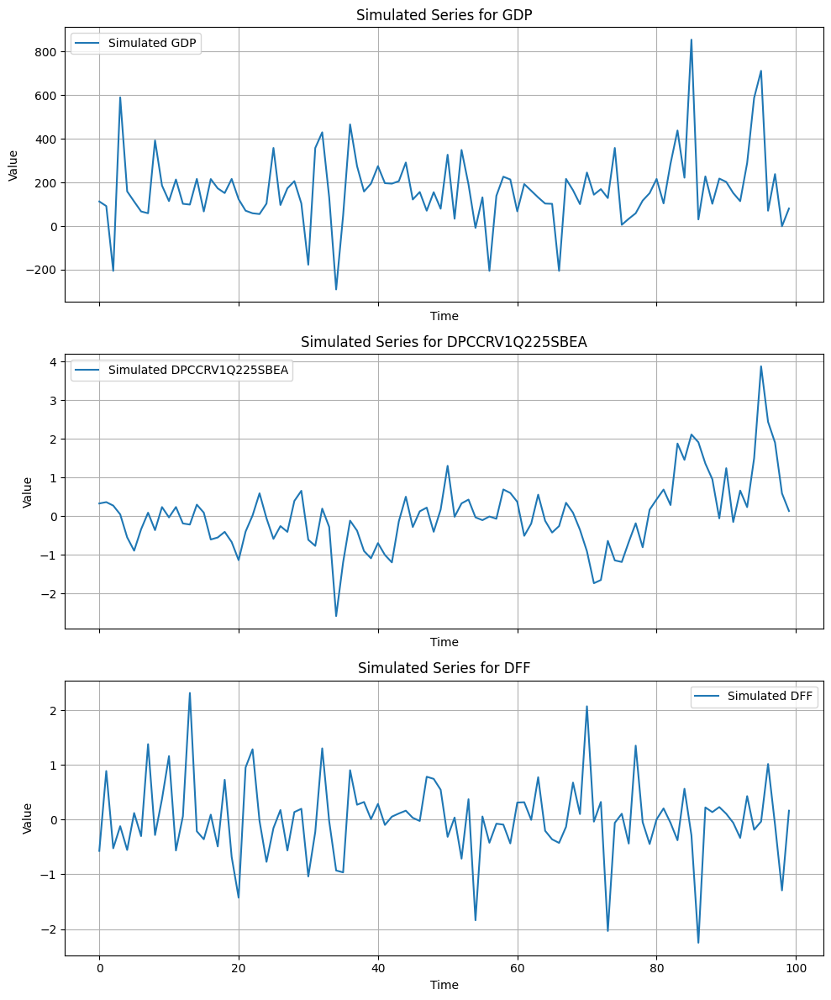

```python
import pandas as pd
import numpy as np
import matplotlib.pyplot as plt
from econometron.utils.data_preparation import TransformTS
from econometron.Models.VectorAutoReg.VARMA import VARMA
```


```python
GDP=pd.read_csv("../../Data_Fred/gdp.csv", index_col=0, parse_dates=True)
Inflation=pd.read_csv("../../Data_Fred/inflation.csv", index_col=0, parse_dates=True)
Interest_Rate=pd.read_csv("../../Data_Fred/int_rate.csv", index_col=0, parse_dates=True)
mac_data=pd.concat([GDP, Inflation, Interest_Rate], axis=1).dropna()
TSP=TransformTS(mac_data,method='diff',analysis=True,plot=True)
data=TSP.get_transformed_data()
```

    
    === Time Series Analysis ===
    
    Stationarity Check (ADF Test):
    Column GDP: Stationary, p-value: 0.0000, ADF Statistic: -4.9856
    Column DPCCRV1Q225SBEA: Stationary, p-value: 0.0276, ADF Statistic: -3.0857
    Column DFF: Stationary, p-value: 0.0000, ADF Statistic: -5.6126
    
    Summary Statistics:
                   GDP  DPCCRV1Q225SBEA         DFF
    count   140.000000     1.410000e+02  140.000000
    mean    172.066757     2.834612e-16   -0.026000
    std     261.390203     1.116470e+00    0.719533
    min   -1792.213000    -2.962411e+00   -2.720000
    25%      96.405500    -6.624113e-01   -0.170000
    50%     151.305500    -2.624113e-01    0.000000
    75%     222.718000     4.375887e-01    0.242500
    max    1749.107000     3.937589e+00    2.270000
    
    NaN Counts:
    GDP                1
    DPCCRV1Q225SBEA    0
    DFF                1
    dtype: int64
    
    Correlation Matrix:
                          GDP  DPCCRV1Q225SBEA       DFF
    GDP              1.000000         0.500033  0.261576
    DPCCRV1Q225SBEA  0.500033         1.000000  0.169277
    DFF              0.261576         0.169277  1.000000
    


    

    


    

    


    

    


```python
svarma=VARMA(data,max_p=1,max_q=1,structural_id=True)
```

    Performing stationarity checks...
    
    Column: GDP
    Verdict , The serie : GDP is stationary
    
    Column: DPCCRV1Q225SBEA
    Verdict , The serie : DPCCRV1Q225SBEA is stationary
    
    Column: DFF
    Verdict , The serie : DFF is stationary
    

    C:\Users\ASUS\econometron\econometron\Models\VectorAutoReg\VAR.py:124: InterpolationWarning: The test statistic is outside of the range of p-values available in the
    look-up table. The actual p-value is smaller than the p-value returned.
    
      results=kpss(series.dropna(),regression='c', nlags='auto')
    C:\Users\ASUS\econometron\econometron\Models\VectorAutoReg\VAR.py:124: InterpolationWarning: The test statistic is outside of the range of p-values available in the
    look-up table. The actual p-value is greater than the p-value returned.
    
      results=kpss(series.dropna(),regression='c', nlags='auto')
    C:\Users\ASUS\econometron\econometron\Models\VectorAutoReg\VAR.py:124: InterpolationWarning: The test statistic is outside of the range of p-values available in the
    look-up table. The actual p-value is greater than the p-value returned.
    
      results=kpss(series.dropna(),regression='c', nlags='auto')
    


```python
svarma.fit(plot=True)
```

    INFO:econometron.Models.VectorAutoReg.VARMA:[INFO] Starting VARMA fit with p=None, q=None, stability=False, plot=True
    INFO:econometron.Models.VectorAutoReg.VARMA:[INFO] Structural identification mode
    C:\Users\ASUS\econometron\econometron\Models\VectorAutoReg\VAR.py:124: InterpolationWarning: The test statistic is outside of the range of p-values available in the
    look-up table. The actual p-value is smaller than the p-value returned.
    
      results=kpss(series.dropna(),regression='c', nlags='auto')
    C:\Users\ASUS\econometron\econometron\Models\VectorAutoReg\VAR.py:124: InterpolationWarning: The test statistic is outside of the range of p-values available in the
    look-up table. The actual p-value is greater than the p-value returned.
    
      results=kpss(series.dropna(),regression='c', nlags='auto')
    C:\Users\ASUS\econometron\econometron\Models\VectorAutoReg\VAR.py:124: InterpolationWarning: The test statistic is outside of the range of p-values available in the
    look-up table. The actual p-value is greater than the p-value returned.
    
      results=kpss(series.dropna(),regression='c', nlags='auto')
    

    1 10
    Performing stationarity checks...
    
    Column: GDP
    Verdict , The serie : GDP is stationary
    
    Column: DPCCRV1Q225SBEA
    Verdict , The serie : DPCCRV1Q225SBEA is stationary
    
    Column: DFF
    Verdict , The serie : DFF is stationary
    Selecting only columns with numeric data
    Component 1: sccs=0.103754, tst=14.569, deg=12, pv=0.266, dsq=1.000
    Component 1: Kronecker index 0, pv=0.266
    Component 2: sccs=0.596452, tst=120.692, deg=12, pv=0.000, dsq=1.000
    Component 3: sccs=0.161162, tst=23.285, deg=11, pv=0.016, dsq=1.000
    Component 2: sccs=0.111727, tst=12.914, deg=10, pv=0.229, dsq=1.199
    Component 2: Kronecker index 1, pv=0.229
    Component 3: sccs=0.134079, tst=11.823, deg=10, pv=0.297, dsq=1.565
    Component 3: Kronecker index 1, pv=0.297
    AR coefficient matrix:
    [[1 0 0 0 0 0]
     [0 1 0 0 2 2]
     [0 0 1 0 2 2]]
    MA coefficient matrix:
    [[1 0 0 0 0 0]
     [0 1 0 2 2 2]
     [0 0 1 2 2 2]]
    Number of parameters: 13
    -------------------------------------------------------
      ini_est    | lower bound  |  upperbound  |    s.err    
    -------------------------------------------------------
      176.5569   |   130.933    |   222.1808   |   22.8119   
      -0.0103    |    -0.138    |    0.1174    |    0.0639   
       0.8812    |    0.7173    |    1.0451    |    0.082    
      -0.0979    |   -0.5671    |    0.3713    |    0.2346   
        0.0      |   -0.0006    |    0.0007    |    0.0003   
      -0.4193    |   -0.7068    |   -0.1317    |    0.1438   
       0.1174    |   -0.3962    |    0.6309    |    0.2568   
       -0.006    |   -0.1246    |    0.1126    |    0.0593   
       0.1607    |    0.0085    |    0.3129    |    0.0761   
      -0.1938    |   -0.6295    |    0.2419    |    0.2179   
       0.0003    |   -0.0003    |    0.0009    |    0.0003   
      -0.1895    |   -0.4565    |    0.0775    |    0.1335   
       0.2225    |   -0.2544    |    0.6994    |    0.2385   
    

    c:\Python310\lib\site-packages\scipy\optimize\_differentiable_functions.py:231: UserWarning: delta_grad == 0.0. Check if the approximated function is linear. If the function is linear better results can be obtained by defining the Hessian as zero instead of using quasi-Newton approximations.
      self.H.update(self.x - self.x_prev, self.g - self.g_prev)
    

    `xtol` termination condition is satisfied.
    Number of iterations: 217, function evaluations: 3906, CG iterations: 1346, optimality: 3.39e-06, constraint violation: 0.00e+00, execution time: 2.2e+01 s.
    Model fitted with p=1, q=1, Log-likelihood: -1238.2887
    ======================================================================
                            Structural VARMA(1,1)                         
    ======================================================================
    Log-likelihood: -1238.2887 | Model type: Structural | Time: 2025-08-14 15:44:35
    AIC: 9.5916 | BIC: 9.8648 | HQIC: 9.7026 | Hannan-Rissanen Method
    ======================================================================
    
    Contemporaneous Impact Matrix (Ph0):
    Identity matrix (no contemporaneous effects)
    ======================================================================
    
    Parameter Estimates:
    
    Lag Type From To      Value  Std. Error    t-Stat      p-Value Signif
         Cst      Y1 172.540752   21.394653  8.064667 6.661338e-16    ***
         Cst      Y2   0.000831    0.048633  0.017087 9.863673e-01       
      1   AR   Y2 Y2   0.784742    0.077321 10.149084 0.000000e+00    ***
      1   AR   Y2 Y3   0.354529    0.458170  0.773793 4.390534e-01       
      1   AR   Y3 Y1   0.000039    0.000248  0.156205 8.758716e-01       
      1   AR   Y3 Y2  -0.293687    0.131163 -2.239098 2.514951e-02     **
      1   AR   Y3 Y3  -0.396155    0.446929 -0.886393 3.754057e-01       
         Cst      Y3  -0.024459    0.051859 -0.471634 6.371883e-01       
      1   AR   Y3 Y2   0.022986    0.076936  0.298772 7.651142e-01       
      1   AR   Y3 Y3   0.120751    0.383081  0.315211 7.526016e-01       
      1   MA   Y1 Y1   0.000553    0.000250  2.213381 2.687136e-02     **
      1   MA   Y1 Y2  -0.072831    0.126539 -0.575561 5.649117e-01       
      1   MA   Y1 Y3  -0.213119    0.365811 -0.582592 5.601681e-01       
    ======================================================================
    AIC: 9.5916
    ===================Stability===========================
    Maximum eigenvalue modulus: 0.7968
    The VARMA AR-part is non-stable
    ===================Invertibility===========================
    Maximum MA eigenvalue modulus: 0.4280
    The VARMA MA-part is invertible
    \nOverall Model Condition: Conditions violated
    ===================Serial COrrelation Tests===========================
    ===============Ljung–Box Test (lags=8)==============
    Residual 0 (GDP): p-value = 0.7667 → PASS
    Residual 1 (DPCCRV1Q225SBEA): p-value = 0.8293 → PASS
    Residual 2 (DFF): p-value = 0.7556 → PASS
    ==================Durbin-Watson Statistics=================
    Residual 0 (GDP): DW = 1.9492 → PASS
    Residual 1 (DPCCRV1Q225SBEA): DW = 1.8801 → PASS
    Residual 2 (DFF): DW = 1.9400 → PASS
    ==================Heteroscedasticity=================
    Residual 0 (GDP): ARCH p-value = 0.0000 → FAIL
    Residual 1 (DPCCRV1Q225SBEA): ARCH p-value = 0.0012 → FAIL
    Residual 2 (DFF): ARCH p-value = 0.0159 → FAIL
    =======================Normality Test=======================
    Residual 0 (GDP): JB p-value = 0.0000, Shapiro p-value = 0.0000
    Residual 1 (DPCCRV1Q225SBEA): JB p-value = 0.0000, Shapiro p-value = 0.0000
    Residual 2 (DFF): JB p-value = 0.0000, Shapiro p-value = 0.0000
    ========================Structural Breaks============================
    CUSUM p-value: 0.0001
    \n==================Diagnostic Summary=================
    Estimation                | Cond.MLE
    Model                     | VARMA(1,1)
    Log-Likelihood            | -1238.2887189999542
    AIC                       | 9.591600019585869
    BIC                       | N/A
    Stability                 | 0.000 (Not Stable)
    Autocorrelation           | 1.000 (Passed)
      - DW Score              | 1.000 (Passed)
      - LB Score              | 1.000 (Passed)
    Heteroscedasticity        | 0.000 (Failed)
    Normality                 | 0.000 (Failed)
      - JB Score              | 0.000
      - Shapiro Score         | 0.000
    Structural Breaks         | 0.000 (Failed)
    Final Score               | 0.400
    Verdict                   | Failed (Threshold: 0.8)
    --------------------------------------------------
    

    C:\Users\ASUS\econometron\econometron\Models\VectorAutoReg\VARMA.py:731: UserWarning: The models is not well(Under/Over) Fitted on the Data
      warnings.warn("The models is not well(Under/Over) Fitted on the Data")
    


    

    


    

    


    

    


    {'par': array([ 1.72540752e+02,  8.30981788e-04,  7.84741902e-01,  3.54528744e-01,
             3.87394871e-05, -2.93686809e-01, -3.96155083e-01, -2.44585219e-02,
             2.29862120e-02,  1.20751268e-01,  5.52610566e-04, -7.28308085e-02,
            -2.13118670e-01]),
     'A': array([[[0.        , 0.        , 0.        ],
             [0.        , 0.78474112, 0.35452839],
             [0.        , 0.02298619, 0.12075115]]]),
     'B': array([[[ 0.00000000e+00,  0.00000000e+00,  0.00000000e+00],
             [ 3.87394484e-05, -2.93686515e-01, -3.96154686e-01],
             [ 5.52610014e-04, -7.28307357e-02, -2.13118457e-01]]]),
     'p': 1,
     'q': 1,
     'Cst': array([[ 1.72540580e+02,  8.30980957e-04, -2.44584974e-02]]),
     'aic': 9.591600019585869,
     'residuals': array([[-8.52135796e+01, -1.17452580e+02, -1.82923580e+02,
             -1.42095580e+02, -8.08565796e+01, -9.34655796e+01,
             -1.13937580e+02, -7.39785796e+01, -6.48795796e+01,
             -7.66625796e+01, -5.83785796e+01, -1.23884580e+02,
             -9.30605796e+01, -9.93815796e+01, -4.09005796e+01,
             -7.06265796e+01, -4.12615796e+01, -8.83965796e+01,
             -4.83275796e+01, -1.05539580e+02, -1.13832580e+02,
             -7.04125796e+01, -8.30795796e+01, -7.66585796e+01,
             -8.16857963e+00, -7.39725796e+01, -4.41775796e+01,
             -6.96565796e+01, -1.63705796e+01, -2.85425796e+01,
             -6.94565796e+01, -7.19675796e+01, -6.93215796e+01,
             -2.11425796e+01,  3.53420365e-01, -5.48495796e+01,
             -5.80125796e+01, -1.21245796e+01,  4.10024204e+01,
             -7.05305796e+01,  7.30004204e+01, -1.02095580e+02,
             -5.49615796e+01, -1.38053580e+02, -4.37715796e+01,
             -1.73520580e+02, -1.10095580e+02, -4.95055796e+01,
             -6.85805796e+01, -7.59605796e+01, -9.51475796e+01,
             -5.98445796e+01, -3.39035796e+01,  8.13624204e+01,
              3.30244204e+01, -2.13275796e+01,  1.68274204e+01,
              1.99514204e+01,  4.93664204e+01,  6.75314204e+01,
             -1.71705796e+01,  4.74454204e+01,  9.02142037e+00,
              1.02415420e+02, -1.82765796e+01, -5.57765796e+01,
             -3.16857963e+00,  3.55042037e+00,  1.38904204e+01,
             -1.05055796e+01, -2.15995796e+01, -1.81060580e+02,
             -1.33775796e+01, -1.39242580e+02, -4.63330580e+02,
             -3.49847580e+02, -2.22206580e+02, -1.04894580e+02,
              2.98264204e+01, -5.91795796e+01,  4.30424204e+01,
             -1.11265796e+01, -4.67357963e+00, -1.30566580e+02,
              3.35504204e+01, -8.23995796e+01,  2.20384204e+01,
              5.40054204e+01, -3.42305796e+01, -6.01145796e+01,
             -7.16625796e+01,  5.52294204e+01, -9.20425796e+01,
              5.26104204e+01,  6.56404204e+01, -1.66821580e+02,
              1.48229420e+02,  1.13179420e+02, -6.46895796e+01,
             -2.10905796e+01,  4.37144204e+01, -5.06985796e+01,
             -1.39029580e+02, -8.17445796e+01,  1.32284204e+01,
              8.39642037e+00,  2.41994204e+01,  1.81644204e+01,
             -1.39815796e+01,  8.14114204e+01,  1.71952420e+02,
              1.18924420e+02,  7.98184204e+01,  4.52774204e+01,
             -5.34035796e+01,  2.11924204e+01,  1.13797420e+02,
              1.46692420e+02,  4.35054204e+01, -3.78100580e+02,
             -1.96475358e+03,  1.57656642e+03,  2.11675420e+02,
              4.15485420e+02,  5.39527420e+02,  3.80589420e+02,
              6.82506420e+02,  2.65912420e+02,  4.17759420e+02,
              2.93679420e+02,  2.89725420e+02,  2.57541420e+02,
              1.16915420e+02,  3.41341420e+02,  1.56729420e+02,
              1.54561420e+02,  2.20104420e+02,  1.85659420e+02,
              1.76409420e+02,  6.56424204e+01],
            [ 2.33675767e+00,  8.15357112e-01,  4.97130318e-02,
              5.45244671e-01, -8.86477894e-02,  6.72267468e-01,
              1.46905046e-01,  1.70901112e-01,  1.95232854e-03,
             -3.27063340e-01,  5.56296760e-01,  1.16660229e-01,
              4.53417377e-01, -4.31015865e-01, -2.36333494e-01,
             -3.56492211e-01,  7.20673264e-01, -2.99196723e-02,
             -2.03626301e-01,  1.21174600e-01,  3.89863759e-01,
             -2.37434140e-01,  6.90581581e-02, -3.73268250e-01,
              5.24200719e-02, -1.32286499e-01,  5.19205383e-01,
             -4.94653327e-01,  2.40846785e-01, -1.10907112e+00,
             -1.68910208e-01, -3.54823718e-01, -2.94557318e-01,
             -6.44111323e-02, -2.29174517e-01, -5.31253575e-01,
             -7.55775329e-02, -7.32305951e-02,  3.16893928e-01,
              2.56651068e-01, -6.85845233e-01,  2.08856034e-01,
              1.94626009e-01,  6.90723237e-01, -8.12031499e-01,
             -8.65232591e-01,  3.47525260e-01, -7.05065986e-01,
              5.33314395e-01,  3.74877032e-02, -6.58859773e-01,
             -5.18509557e-01, -5.99498192e-02,  1.42740312e-01,
             -2.20265277e-02,  3.11561240e-01,  1.97242013e-01,
             -7.92399099e-01,  4.34493834e-01,  8.58777301e-01,
             -4.58553410e-01, -5.10756024e-01,  8.86446033e-01,
              1.58096033e-02,  9.89040984e-01, -4.44820240e-01,
             -5.52290519e-01,  8.74423975e-01, -6.99436158e-01,
              2.43059452e-02,  7.72980114e-01, -3.37260046e-01,
             -5.63947094e-01,  8.25385467e-02, -2.42524171e+00,
             -9.38177227e-01,  8.63864030e-01, -9.51939425e-03,
              1.03759007e+00, -6.66325826e-01, -6.20897634e-01,
             -8.91866003e-01,  1.01320609e-01,  3.45328082e-01,
              6.47436896e-01, -3.07860042e-01, -5.37715755e-01,
              8.02803175e-01, -4.93922965e-01, -7.24500499e-01,
              1.94260626e-01, -2.03099882e-01, -6.46842092e-01,
              9.00344132e-02,  2.40730273e-02, -4.87851106e-01,
              1.77671682e-01, -2.92075395e-01, -6.38213660e-01,
             -8.32784520e-01,  5.50290344e-01, -4.11599518e-01,
             -5.82452751e-01,  3.05208449e-01,  5.33926563e-01,
             -2.77983724e-01, -4.41641665e-01,  2.13239097e-01,
             -5.87426013e-01, -4.24050498e-01,  2.92770522e-01,
              8.01592432e-01, -8.05568226e-02, -8.96063428e-01,
              1.62568536e-01, -3.04860836e-01, -6.65834269e-02,
             -3.06709822e-01, -3.48913288e-01, -1.82031198e-02,
             -2.63236506e+00,  2.58068319e+00, -4.83559153e-02,
              1.30559975e+00,  3.05727911e+00,  6.08879031e-01,
              1.08367434e+00,  1.67071695e+00, -1.31252310e-01,
              8.52816784e-01,  3.29133556e-01,  6.56854480e-01,
             -1.39852101e-01, -1.08253199e+00, -6.88993725e-01,
              1.37295318e+00, -2.26366627e-01, -5.48581796e-01,
              1.85995039e-01,  9.61928665e-01],
            [ 3.54458497e-01,  2.43697670e-01,  8.37306968e-02,
             -2.59298577e+00,  8.35477818e-01,  4.47493255e-03,
             -8.74945632e-01, -1.30386040e+00,  8.26542352e-01,
             -9.77817651e-01, -3.49230753e-01, -8.79013047e-01,
              6.60516225e-01,  1.09635790e-01, -6.98063165e-03,
             -3.00544786e-01,  8.12858068e-01,  3.45231760e-01,
              1.73980568e+00, -2.84764392e-01,  1.45272759e+00,
              6.56778283e-02,  1.79048403e-01, -1.36357720e+00,
              7.39463806e-01,  2.36981463e+00, -1.97502145e+00,
              6.66714523e-01,  1.37939813e-02,  1.25080535e-01,
             -5.82113125e-01,  2.07546721e-01, -3.82020819e-02,
              6.99784208e-01, -4.97960373e-01, -1.66386304e+00,
              1.22864372e+00,  5.18577511e-01, -3.90692927e-01,
             -1.26197670e+00,  2.14796452e+00,  8.36225435e-01,
             -6.29827051e-02, -1.09928869e+00, -6.95891694e-02,
             -1.33560803e+00, -9.68784596e-01, -1.47752654e+00,
              2.48826017e-01,  5.98934761e-02,  1.09401893e-01,
             -6.22521768e-01,  1.22535361e-01, -1.15529024e-01,
             -4.66301395e-03, -1.58058655e-01,  1.34914024e-01,
              4.14247204e-01,  4.76852865e-01,  1.84039224e-01,
              9.18670518e-01,  6.26223224e-01,  6.13430258e-01,
              2.93581728e-01,  9.19098998e-01,  2.18734108e-01,
              3.52599307e-01, -1.33257577e-01,  1.93653754e-01,
              1.20446766e-02, -3.52873145e-01, -1.81007521e+00,
             -7.39777213e-01, -3.44141923e-01, -8.91888902e-01,
             -9.23687955e-01,  1.44268939e-01,  2.91426976e-01,
              6.65343407e-02,  4.08319898e-02,  1.62104776e-01,
             -6.94364449e-05,  3.15509840e-02, -1.26544683e-02,
              1.15847530e-01,  4.47145168e-02,  4.90541358e-02,
             -1.64880923e-02,  9.42245368e-02,  3.20743907e-02,
              9.38703255e-02,  3.92989867e-02,  7.76943546e-02,
              7.38471850e-04,  2.27286922e-03, -6.53331192e-03,
              1.10753910e-01,  6.21204139e-03, -5.52224593e-02,
             -2.41558922e-03,  7.21840451e-02,  6.68486608e-02,
              5.53606667e-02,  1.67384960e-01,  2.99709245e-01,
              1.38516461e-01, -8.51077645e-02,  2.52797602e-01,
              3.28463390e-01,  2.86624541e-01,  2.81269511e-03,
              2.29688454e-01,  3.63409782e-01,  2.50012948e-01,
              2.48302431e-01,  3.12156694e-01,  5.34329088e-02,
             -4.24673144e-02, -5.80352338e-01, -3.99570423e-01,
             -1.29260396e+00,  9.11019912e-01, -4.78626294e-01,
             -1.90918409e-01, -1.99190799e-01, -1.46975003e-01,
             -2.59386270e-01, -4.08762770e-01,  8.27746396e-02,
              9.59658650e-01,  1.40803903e+00,  1.19894726e+00,
              4.76227088e-01,  2.03139620e-01,  1.46319667e-02,
             -1.35667896e-01, -2.52171370e-02, -1.33689828e-01,
             -6.47448163e-01, -6.47147034e-01]]),
     'loglikelihood': -1238.2887189999542,
     'Index': [(0, 0),
      (1, 1),
      (2, 7),
      (3, 8),
      (4, 9),
      (5, 10),
      (6, 11),
      (7, 2),
      (8, 10),
      (9, 11),
      (10, 12),
      (11, 13),
      (12, 14)],
     'se': array([2.13946534e+01, 4.86327511e-02, 7.73214503e-02, 4.58170193e-01,
            2.48004536e-04, 1.31162971e-01, 4.46929313e-01, 5.18591551e-02,
            7.69357002e-02, 3.83081002e-01, 2.49668021e-04, 1.26538737e-01,
            3.65811255e-01]),
     'tvals': array([ 8.06466687,  0.01708688, 10.1490841 ,  0.77379268,  0.15620475,
            -2.23909848, -0.88639315, -0.47163364,  0.29877173,  0.3152108 ,
             2.21338145, -0.57556137, -0.58259189]),
     'pvals': array([6.66133815e-16, 9.86367309e-01, 0.00000000e+00, 4.39053400e-01,
            8.75871631e-01, 2.51495094e-02, 3.75405708e-01, 6.37188313e-01,
            7.65114225e-01, 7.52601608e-01, 2.68713586e-02, 5.64911701e-01,
            5.60168067e-01]),
     'signif': ['***', '', '***', '', '', '**', '', '', '', '', '**', '', '']}


```python
pred=svarma.predict(3)
```


    

    


```python
svarma.simulate()
```


    

    


    {'simulations': array([[ 1.12696000e+02,  3.31125846e-01, -5.72474110e-01],
            [ 9.16840000e+01,  3.65648769e-01,  8.86867334e-01],
            [-2.05560000e+02,  2.75910999e-01, -5.24815416e-01],
            [ 5.90300000e+02,  4.90257112e-02, -1.21174367e-01],
            [ 1.59163000e+02, -5.45664133e-01, -5.54964302e-01],
            [ 1.12426000e+02, -8.90453573e-01,  1.19400853e-01],
            [ 6.70010000e+01, -3.36698157e-01, -3.02562892e-01],
            [ 5.87080000e+01,  9.23415749e-02,  1.37753595e+00],
            [ 3.92645000e+02, -3.59108196e-01, -2.82116156e-01],
            [ 1.85769000e+02,  2.37929828e-01,  3.76422961e-01],
            [ 1.14528000e+02, -2.96063991e-02,  1.15965815e+00],
            [ 2.13543000e+02,  2.38839045e-01, -5.64202530e-01],
            [ 1.02128000e+02, -1.85906383e-01,  6.14238313e-02],
            [ 9.85680000e+01, -2.14582528e-01,  2.31288450e+00],
            [ 2.16255000e+02,  2.99884741e-01, -2.14218132e-01],
            [ 6.70010000e+01,  9.28756300e-02, -3.59501544e-01],
            [ 2.15583000e+02, -6.01501973e-01,  8.99119958e-02],
            [ 1.72894000e+02, -5.48692376e-01, -4.90929547e-01],
            [ 1.51398000e+02, -4.03621589e-01,  7.26443857e-01],
            [ 2.16046000e+02, -6.66400958e-01, -6.82499050e-01],
            [ 1.23035000e+02, -1.13508672e+00, -1.42657866e+00],
            [ 7.04450000e+01, -3.96345227e-01,  9.52295980e-01],
            [ 5.87080000e+01,  2.07143521e-02,  1.28430420e+00],
            [ 5.50880000e+01,  5.93353416e-01, -2.61056264e-02],
            [ 1.03084000e+02, -5.22570021e-02, -7.72309974e-01],
            [ 3.58200000e+02, -5.85042061e-01, -1.54628326e-01],
            [ 9.65800000e+01, -2.54342736e-01,  1.74358184e-01],
            [ 1.72894000e+02, -4.03801198e-01, -5.64682529e-01],
            [ 2.06091000e+02,  3.95780978e-01,  1.36931917e-01],
            [ 1.03960000e+02,  6.58539933e-01,  1.96697448e-01],
            [-1.77307000e+02, -6.08685668e-01, -1.03902710e+00],
            [ 3.58200000e+02, -7.65875679e-01, -2.25749590e-01],
            [ 4.30082000e+02,  1.97901958e-01,  1.30066732e+00],
            [ 1.31640000e+02, -2.76978086e-01, -3.08700631e-02],
            [-2.90790000e+02, -2.58212223e+00, -9.30343692e-01],
            [ 4.86560000e+01, -1.19100194e+00, -9.64495756e-01],
            [ 4.66220000e+02, -1.13757173e-01,  9.01737182e-01],
            [ 2.74956000e+02, -3.72194998e-01,  2.71052131e-01],
            [ 1.58559000e+02, -8.99555404e-01,  3.21056081e-01],
            [ 1.94579000e+02, -1.08712424e+00,  7.74087503e-03],
            [ 2.74956000e+02, -6.94385551e-01,  2.85955651e-01],
            [ 1.96740000e+02, -1.00132351e+00, -9.81213895e-02],
            [ 1.94579000e+02, -1.19309381e+00,  5.34067215e-02],
            [ 2.06091000e+02, -1.29727094e-01,  1.11299820e-01],
            [ 2.91465000e+02,  5.05342871e-01,  1.62385352e-01],
            [ 1.21842000e+02, -2.78436969e-01,  3.20016979e-02],
            [ 1.56170000e+02,  1.26957121e-01, -2.54866097e-02],
            [ 7.04450000e+01,  2.23447571e-01,  7.82080313e-01],
            [ 1.55370000e+02, -4.01672212e-01,  7.43940071e-01],
            [ 7.94800000e+01,  1.72857676e-01,  5.44778937e-01],
            [ 3.27102000e+02,  1.30413800e+00, -3.15587501e-01],
            [ 3.35110000e+01, -1.35805228e-02,  3.71041102e-02],
            [ 3.48950000e+02,  3.33064488e-01, -7.13945516e-01],
            [ 1.90705000e+02,  4.31024915e-01,  3.71707857e-01],
            [-8.52000000e+00, -2.84738268e-02, -1.83911030e+00],
            [ 1.31640000e+02, -1.00759586e-01,  5.60991318e-02],
            [-2.05560000e+02, -5.96468989e-03, -4.23472991e-01],
            [ 1.38637000e+02, -6.49424744e-02, -7.56556793e-02],
            [ 2.26546000e+02,  6.93599130e-01, -9.20586951e-02],
            [ 2.13543000e+02,  6.02234753e-01, -4.35435310e-01],
            [ 6.76460000e+01,  3.72831552e-01,  3.11074850e-01],
            [ 1.92492000e+02, -5.05425006e-01,  3.16540370e-01],
            [ 1.62035000e+02, -1.89884444e-01, -5.35636339e-03],
            [ 1.31279000e+02,  5.58278267e-01,  7.73245412e-01],
            [ 1.03219000e+02, -1.16752979e-01, -2.04981402e-01],
            [ 1.01914000e+02, -4.20997853e-01, -3.61152133e-01],
            [-2.05560000e+02, -2.54762002e-01, -4.26329315e-01],
            [ 2.16255000e+02,  3.49043560e-01, -1.32070802e-01],
            [ 1.64372000e+02,  9.18216087e-02,  6.75776012e-01],
            [ 1.00573000e+02, -3.51008331e-01,  1.00874364e-01],
            [ 2.45541000e+02, -9.05503744e-01,  2.06945840e+00],
            [ 1.43998000e+02, -1.73181912e+00, -3.77820730e-02],
            [ 1.69372000e+02, -1.64882176e+00,  3.22115238e-01],
            [ 1.28363000e+02, -6.37269207e-01, -2.03515697e+00],
            [ 3.58200000e+02, -1.14114412e+00, -5.98578153e-02],
            [ 5.71900000e+00, -1.18247886e+00,  1.06592377e-01],
            [ 3.32980000e+01, -6.67379312e-01, -4.38174302e-01],
            [ 5.87080000e+01, -1.81671679e-01,  1.35040334e+00],
            [ 1.16764000e+02, -8.02210556e-01, -4.77397252e-02],
            [ 1.50941000e+02,  1.69182809e-01, -4.46578419e-01],
            [ 2.16255000e+02,  4.37503063e-01,  4.66048487e-03],
            [ 1.03960000e+02,  6.90608864e-01,  2.03682030e-01],
            [ 2.86338000e+02,  2.90550175e-01, -6.03256955e-02],
            [ 4.38453000e+02,  1.88096283e+00, -3.77479648e-01],
            [ 2.21907000e+02,  1.45913399e+00,  5.62430647e-01],
            [ 8.55047000e+02,  2.11434534e+00, -2.88380966e-01],
            [ 3.04450000e+01,  1.91398660e+00, -2.25015078e+00],
            [ 2.27770000e+02,  1.36356051e+00,  2.21506574e-01],
            [ 1.02128000e+02,  9.58187982e-01,  1.36246469e-01],
            [ 2.17818000e+02, -5.40148174e-02,  2.28416107e-01],
            [ 2.02367000e+02,  1.24288536e+00,  1.05415096e-01],
            [ 1.51450000e+02, -1.49166290e-01, -5.88416606e-02],
            [ 1.14162000e+02,  6.63927274e-01, -3.34710962e-01],
            [ 2.89456000e+02,  2.36036361e-01,  4.28264444e-01],
            [ 5.88026000e+02,  1.50043240e+00, -1.84936526e-01],
            [ 7.12068000e+02,  3.87828770e+00, -3.62895216e-02],
            [ 7.04450000e+01,  2.44220288e+00,  1.01446759e+00],
            [ 2.38181000e+02,  1.90449064e+00, -9.33958175e-02],
            [-9.80000000e-01,  5.91591573e-01, -1.29353129e+00],
            [ 8.04980000e+01,  1.36133989e-01,  1.62407943e-01]])}


```python
irfs=svarma.impulse_res()
```


    

    


```python
fevd=svarma.FEVD()
```


    

    


```python
F_Varma=VARMA(data,max_p=4,max_q=4,structural_id=False)
```

    Performing stationarity checks...
    
    Column: GDP
    Verdict , The serie : GDP is stationary
    
    Column: DPCCRV1Q225SBEA
    Verdict , The serie : DPCCRV1Q225SBEA is stationary
    
    Column: DFF
    Verdict , The serie : DFF is stationary
    

    C:\Users\ASUS\econometron\econometron\Models\VectorAutoReg\VAR.py:124: InterpolationWarning: The test statistic is outside of the range of p-values available in the
    look-up table. The actual p-value is smaller than the p-value returned.
    
      results=kpss(series.dropna(),regression='c', nlags='auto')
    C:\Users\ASUS\econometron\econometron\Models\VectorAutoReg\VAR.py:124: InterpolationWarning: The test statistic is outside of the range of p-values available in the
    look-up table. The actual p-value is greater than the p-value returned.
    
      results=kpss(series.dropna(),regression='c', nlags='auto')
    C:\Users\ASUS\econometron\econometron\Models\VectorAutoReg\VAR.py:124: InterpolationWarning: The test statistic is outside of the range of p-values available in the
    look-up table. The actual p-value is greater than the p-value returned.
    
      results=kpss(series.dropna(),regression='c', nlags='auto')
    


```python
varma=F_Varma.fit(p=1,q=0,plot=True)
```

    INFO:econometron.Models.VectorAutoReg.VARMA:[INFO] Starting VARMA fit with p=1, q=0, stability=False, plot=True
    INFO:econometron.Models.VectorAutoReg.VARMA:[INFO] Using non-structural VARMA, p=1, q=0
    C:\Users\ASUS\econometron\econometron\Models\VectorAutoReg\VAR.py:124: InterpolationWarning: The test statistic is outside of the range of p-values available in the
    look-up table. The actual p-value is smaller than the p-value returned.
    
      results=kpss(series.dropna(),regression='c', nlags='auto')
    C:\Users\ASUS\econometron\econometron\Models\VectorAutoReg\VAR.py:124: InterpolationWarning: The test statistic is outside of the range of p-values available in the
    look-up table. The actual p-value is greater than the p-value returned.
    
      results=kpss(series.dropna(),regression='c', nlags='auto')
    C:\Users\ASUS\econometron\econometron\Models\VectorAutoReg\VAR.py:124: InterpolationWarning: The test statistic is outside of the range of p-values available in the
    look-up table. The actual p-value is greater than the p-value returned.
    
      results=kpss(series.dropna(),regression='c', nlags='auto')
    

    1 10
    Performing stationarity checks...
    
    Column: GDP
    Verdict , The serie : GDP is stationary
    
    Column: DPCCRV1Q225SBEA
    Verdict , The serie : DPCCRV1Q225SBEA is stationary
    
    Column: DFF
    Verdict , The serie : DFF is stationary
    Selecting only columns with numeric data
    Number of parameters: 12
    -------------------------------------------------------
      ini_est    | lower bound  |  upperbound  |    s.err    
    -------------------------------------------------------
      206.9031   |   147.8649   |   265.9413   |   29.5191   
      -0.1406    |   -0.3465    |    0.0653    |    0.1029   
      70.5461    |   19.9014    |   121.1909   |   25.3224   
       3.5739    |   -64.0947   |   71.2425    |   33.8343   
       0.0466    |   -0.1256    |    0.2189    |    0.0861   
      -0.0004    |    -0.001    |    0.0002    |    0.0003   
       0.759     |    0.6112    |    0.9067    |    0.0739   
       0.0072    |   -0.1903    |    0.2046    |    0.0987   
      -0.0445    |   -0.2002    |    0.1113    |    0.0779   
       0.0002    |   -0.0003    |    0.0007    |    0.0003   
       0.076     |   -0.0577    |    0.2096    |    0.0668   
      -0.0108    |   -0.1893    |    0.1678    |    0.0893   
    

    c:\Python310\lib\site-packages\scipy\optimize\_differentiable_functions.py:231: UserWarning: delta_grad == 0.0. Check if the approximated function is linear. If the function is linear better results can be obtained by defining the Hessian as zero instead of using quasi-Newton approximations.
      self.H.update(self.x - self.x_prev, self.g - self.g_prev)
    

    `xtol` termination condition is satisfied.
    Number of iterations: 135, function evaluations: 1508, CG iterations: 520, optimality: 1.53e-06, constraint violation: 0.00e+00, execution time:  6.0 s.
    

    C:\Users\ASUS\econometron\econometron\Models\VectorAutoReg\VARMA.py:474: RuntimeWarning: invalid value encountered in sqrt
      se = np.sqrt(np.diag(hess_inv))
    C:\Users\ASUS\econometron\econometron\Models\VectorAutoReg\VARMA.py:731: UserWarning: The models is not well(Under/Over) Fitted on the Data
      warnings.warn("The models is not well(Under/Over) Fitted on the Data")
    

    Model fitted with p=1, q=0, Log-likelihood: -1241.0669
    ======================================================================
                          Non-Structural VARMA(1,0)                       
    ======================================================================
    Log-likelihood: -1241.0669 | Model type: Non-Structural | Time: 2025-08-14 15:48:54
    AIC: 9.6089 | BIC: 9.8610 | HQIC: 9.7114 | Hannan-Rissanen Method
    ======================================================================
    
    Parameter Estimates:
    
    Lag Type From To      Value  Std. Error    t-Stat  p-Value Signif
         Cst      Y1 189.841056         NaN       NaN      NaN       
         Cst      Y2   0.050229    0.063184  0.794955 0.426640       
         Cst      Y3  -0.084465    0.073868 -1.143458 0.252849       
      1   AR   Y1 Y1   9.950102   16.624131  0.598534 0.549484       
      1   AR   Y1 Y2   0.050229    0.063184  0.794955 0.426640       
      1   AR   Y1 Y3  -0.000372    0.000254 -1.462259 0.143670       
      1   AR   Y2 Y1   0.760570    0.058037 13.104834 0.000000    ***
      1   AR   Y2 Y2   0.014611    0.079249  0.184369 0.853724       
      1   AR   Y2 Y3  -0.084465    0.073868 -1.143458 0.252849       
      1   AR   Y3 Y1   0.000327    0.000266  1.229040 0.219057       
      1   AR   Y3 Y2   0.046936    0.062117  0.755605 0.449886       
      1   AR   Y3 Y3  -0.046315    0.084847 -0.545869 0.585156       
    ======================================================================
    AIC: 9.6089
    ===================Stability===========================
    Maximum eigenvalue modulus: 0.7383
    The VARMA AR-part is non-stable
    ===================Invertibility===========================
    No MA terms - automatically invertible
    \nOverall Model Condition: Conditions violated
    ===================Serial COrrelation Tests===========================
    ===============Ljung–Box Test (lags=8)==============
    Residual 0 (GDP): p-value = 0.8433 → PASS
    Residual 1 (DPCCRV1Q225SBEA): p-value = 0.0817 → PASS
    Residual 2 (DFF): p-value = 0.8981 → PASS
    ==================Durbin-Watson Statistics=================
    Residual 0 (GDP): DW = 2.0315 → PASS
    Residual 1 (DPCCRV1Q225SBEA): DW = 2.2122 → PASS
    Residual 2 (DFF): DW = 2.0142 → PASS
    ==================Heteroscedasticity=================
    Residual 0 (GDP): ARCH p-value = 0.0000 → FAIL
    Residual 1 (DPCCRV1Q225SBEA): ARCH p-value = 0.0000 → FAIL
    Residual 2 (DFF): ARCH p-value = 0.0000 → FAIL
    =======================Normality Test=======================
    Residual 0 (GDP): JB p-value = 0.0000, Shapiro p-value = 0.0000
    Residual 1 (DPCCRV1Q225SBEA): JB p-value = 0.0000, Shapiro p-value = 0.0000
    Residual 2 (DFF): JB p-value = 0.0000, Shapiro p-value = 0.0000
    ========================Structural Breaks============================
    CUSUM p-value: 0.0013
    \n==================Diagnostic Summary=================
    Estimation                | Cond.MLE
    Model                     | VARMA(1,0)
    Log-Likelihood            | -1241.0668893111733
    AIC                       | 9.60889962437959
    BIC                       | N/A
    Stability                 | 0.000 (Not Stable)
    Autocorrelation           | 1.000 (Passed)
      - DW Score              | 1.000 (Passed)
      - LB Score              | 1.000 (Passed)
    Heteroscedasticity        | 0.000 (Failed)
    Normality                 | 0.000 (Failed)
      - JB Score              | 0.000
      - Shapiro Score         | 0.000
    Structural Breaks         | 0.000 (Failed)
    Final Score               | 0.400
    Verdict                   | Failed (Threshold: 0.8)
    --------------------------------------------------
    


    

    


    

    


    

    


```python
varma=F_Varma.fit(plot=True)
```

    INFO:econometron.Models.VectorAutoReg.VARMA:[INFO] Starting VARMA fit with p=None, q=None, stability=False, plot=True
    INFO:econometron.Models.VectorAutoReg.VARMA:[INFO] Falling back to grid search over p=0 to 4, q=0 to 4
    C:\Users\ASUS\econometron\econometron\Models\VectorAutoReg\VAR.py:124: InterpolationWarning: The test statistic is outside of the range of p-values available in the
    look-up table. The actual p-value is smaller than the p-value returned.
    
      results=kpss(series.dropna(),regression='c', nlags='auto')
    C:\Users\ASUS\econometron\econometron\Models\VectorAutoReg\VAR.py:124: InterpolationWarning: The test statistic is outside of the range of p-values available in the
    look-up table. The actual p-value is greater than the p-value returned.
    
      results=kpss(series.dropna(),regression='c', nlags='auto')
    C:\Users\ASUS\econometron\econometron\Models\VectorAutoReg\VAR.py:124: InterpolationWarning: The test statistic is outside of the range of p-values available in the
    look-up table. The actual p-value is greater than the p-value returned.
    
      results=kpss(series.dropna(),regression='c', nlags='auto')
    

    1 10
    Performing stationarity checks...
    
    Column: GDP
    Verdict , The serie : GDP is stationary
    
    Column: DPCCRV1Q225SBEA
    Verdict , The serie : DPCCRV1Q225SBEA is stationary
    
    Column: DFF
    Verdict , The serie : DFF is stationary
    Selecting only columns with numeric data
    

    c:\Python310\lib\site-packages\scipy\optimize\_differentiable_functions.py:231: UserWarning: delta_grad == 0.0. Check if the approximated function is linear. If the function is linear better results can be obtained by defining the Hessian as zero instead of using quasi-Newton approximations.
      self.H.update(self.x - self.x_prev, self.g - self.g_prev)
    

    1 10
    Performing stationarity checks...
    
    Column: GDP
    Verdict , The serie : GDP is stationary
    
    Column: DPCCRV1Q225SBEA
    Verdict , The serie : DPCCRV1Q225SBEA is stationary
    
    Column: DFF
    Verdict , The serie : DFF is stationary
    Selecting only columns with numeric data
    

    C:\Users\ASUS\econometron\econometron\Models\VectorAutoReg\VAR.py:124: InterpolationWarning: The test statistic is outside of the range of p-values available in the
    look-up table. The actual p-value is smaller than the p-value returned.
    
      results=kpss(series.dropna(),regression='c', nlags='auto')
    C:\Users\ASUS\econometron\econometron\Models\VectorAutoReg\VAR.py:124: InterpolationWarning: The test statistic is outside of the range of p-values available in the
    look-up table. The actual p-value is greater than the p-value returned.
    
      results=kpss(series.dropna(),regression='c', nlags='auto')
    C:\Users\ASUS\econometron\econometron\Models\VectorAutoReg\VAR.py:124: InterpolationWarning: The test statistic is outside of the range of p-values available in the
    look-up table. The actual p-value is greater than the p-value returned.
    
      results=kpss(series.dropna(),regression='c', nlags='auto')
    C:\Users\ASUS\AppData\Roaming\Python\Python310\site-packages\numpy\linalg\linalg.py:2094: RuntimeWarning: invalid value encountered in slogdet
      sign, logdet = _umath_linalg.slogdet(a, signature=signature)
    WARNING:econometron.Models.VectorAutoReg.VARMA:[WARN] Optimization failed for p=0, q=2: fun=nan
    C:\Users\ASUS\econometron\econometron\Models\VectorAutoReg\VAR.py:124: InterpolationWarning: The test statistic is outside of the range of p-values available in the
    look-up table. The actual p-value is smaller than the p-value returned.
    
      results=kpss(series.dropna(),regression='c', nlags='auto')
    C:\Users\ASUS\econometron\econometron\Models\VectorAutoReg\VAR.py:124: InterpolationWarning: The test statistic is outside of the range of p-values available in the
    look-up table. The actual p-value is greater than the p-value returned.
    
      results=kpss(series.dropna(),regression='c', nlags='auto')
    C:\Users\ASUS\econometron\econometron\Models\VectorAutoReg\VAR.py:124: InterpolationWarning: The test statistic is outside of the range of p-values available in the
    look-up table. The actual p-value is greater than the p-value returned.
    
      results=kpss(series.dropna(),regression='c', nlags='auto')
    C:\Users\ASUS\AppData\Roaming\Python\Python310\site-packages\numpy\linalg\linalg.py:2094: RuntimeWarning: invalid value encountered in slogdet
      sign, logdet = _umath_linalg.slogdet(a, signature=signature)
    

    1 10
    Performing stationarity checks...
    
    Column: GDP
    Verdict , The serie : GDP is stationary
    
    Column: DPCCRV1Q225SBEA
    Verdict , The serie : DPCCRV1Q225SBEA is stationary
    
    Column: DFF
    Verdict , The serie : DFF is stationary
    Selecting only columns with numeric data
    

    WARNING:econometron.Models.VectorAutoReg.VARMA:[WARN] Optimization failed for p=0, q=3: fun=nan
    C:\Users\ASUS\econometron\econometron\Models\VectorAutoReg\VAR.py:124: InterpolationWarning: The test statistic is outside of the range of p-values available in the
    look-up table. The actual p-value is smaller than the p-value returned.
    
      results=kpss(series.dropna(),regression='c', nlags='auto')
    C:\Users\ASUS\econometron\econometron\Models\VectorAutoReg\VAR.py:124: InterpolationWarning: The test statistic is outside of the range of p-values available in the
    look-up table. The actual p-value is greater than the p-value returned.
    
      results=kpss(series.dropna(),regression='c', nlags='auto')
    C:\Users\ASUS\econometron\econometron\Models\VectorAutoReg\VAR.py:124: InterpolationWarning: The test statistic is outside of the range of p-values available in the
    look-up table. The actual p-value is greater than the p-value returned.
    
      results=kpss(series.dropna(),regression='c', nlags='auto')
    C:\Users\ASUS\AppData\Roaming\Python\Python310\site-packages\numpy\linalg\linalg.py:2094: RuntimeWarning: invalid value encountered in slogdet
      sign, logdet = _umath_linalg.slogdet(a, signature=signature)
    

    1 10
    Performing stationarity checks...
    
    Column: GDP
    Verdict , The serie : GDP is stationary
    
    Column: DPCCRV1Q225SBEA
    Verdict , The serie : DPCCRV1Q225SBEA is stationary
    
    Column: DFF
    Verdict , The serie : DFF is stationary
    Selecting only columns with numeric data
    

    WARNING:econometron.Models.VectorAutoReg.VARMA:[WARN] Optimization failed for p=0, q=4: fun=nan
    C:\Users\ASUS\econometron\econometron\Models\VectorAutoReg\VAR.py:124: InterpolationWarning: The test statistic is outside of the range of p-values available in the
    look-up table. The actual p-value is smaller than the p-value returned.
    
      results=kpss(series.dropna(),regression='c', nlags='auto')
    C:\Users\ASUS\econometron\econometron\Models\VectorAutoReg\VAR.py:124: InterpolationWarning: The test statistic is outside of the range of p-values available in the
    look-up table. The actual p-value is greater than the p-value returned.
    
      results=kpss(series.dropna(),regression='c', nlags='auto')
    C:\Users\ASUS\econometron\econometron\Models\VectorAutoReg\VAR.py:124: InterpolationWarning: The test statistic is outside of the range of p-values available in the
    look-up table. The actual p-value is greater than the p-value returned.
    
      results=kpss(series.dropna(),regression='c', nlags='auto')
    

    1 10
    Performing stationarity checks...
    
    Column: GDP
    Verdict , The serie : GDP is stationary
    
    Column: DPCCRV1Q225SBEA
    Verdict , The serie : DPCCRV1Q225SBEA is stationary
    
    Column: DFF
    Verdict , The serie : DFF is stationary
    Selecting only columns with numeric data
    

    c:\Python310\lib\site-packages\scipy\optimize\_differentiable_functions.py:231: UserWarning: delta_grad == 0.0. Check if the approximated function is linear. If the function is linear better results can be obtained by defining the Hessian as zero instead of using quasi-Newton approximations.
      self.H.update(self.x - self.x_prev, self.g - self.g_prev)
    

    1 10
    Performing stationarity checks...
    
    Column: GDP
    Verdict , The serie : GDP is stationary
    
    Column: DPCCRV1Q225SBEA
    Verdict , The serie : DPCCRV1Q225SBEA is stationary
    
    Column: DFF
    Verdict , The serie : DFF is stationary
    Selecting only columns with numeric data
    

    C:\Users\ASUS\econometron\econometron\Models\VectorAutoReg\VAR.py:124: InterpolationWarning: The test statistic is outside of the range of p-values available in the
    look-up table. The actual p-value is smaller than the p-value returned.
    
      results=kpss(series.dropna(),regression='c', nlags='auto')
    C:\Users\ASUS\econometron\econometron\Models\VectorAutoReg\VAR.py:124: InterpolationWarning: The test statistic is outside of the range of p-values available in the
    look-up table. The actual p-value is greater than the p-value returned.
    
      results=kpss(series.dropna(),regression='c', nlags='auto')
    C:\Users\ASUS\econometron\econometron\Models\VectorAutoReg\VAR.py:124: InterpolationWarning: The test statistic is outside of the range of p-values available in the
    look-up table. The actual p-value is greater than the p-value returned.
    
      results=kpss(series.dropna(),regression='c', nlags='auto')
    

    1 10
    Performing stationarity checks...
    
    Column: GDP
    Verdict , The serie : GDP is stationary
    
    Column: DPCCRV1Q225SBEA
    Verdict , The serie : DPCCRV1Q225SBEA is stationary
    
    Column: DFF
    Verdict , The serie : DFF is stationary
    Selecting only columns with numeric data
    

    C:\Users\ASUS\econometron\econometron\Models\VectorAutoReg\VAR.py:124: InterpolationWarning: The test statistic is outside of the range of p-values available in the
    look-up table. The actual p-value is smaller than the p-value returned.
    
      results=kpss(series.dropna(),regression='c', nlags='auto')
    C:\Users\ASUS\econometron\econometron\Models\VectorAutoReg\VAR.py:124: InterpolationWarning: The test statistic is outside of the range of p-values available in the
    look-up table. The actual p-value is greater than the p-value returned.
    
      results=kpss(series.dropna(),regression='c', nlags='auto')
    C:\Users\ASUS\econometron\econometron\Models\VectorAutoReg\VAR.py:124: InterpolationWarning: The test statistic is outside of the range of p-values available in the
    look-up table. The actual p-value is greater than the p-value returned.
    
      results=kpss(series.dropna(),regression='c', nlags='auto')
    WARNING:econometron.Models.VectorAutoReg.VARMA:[WARN] Optimization failed for p=1, q=2: fun=1366.3892274010684
    C:\Users\ASUS\econometron\econometron\Models\VectorAutoReg\VAR.py:124: InterpolationWarning: The test statistic is outside of the range of p-values available in the
    look-up table. The actual p-value is smaller than the p-value returned.
    
      results=kpss(series.dropna(),regression='c', nlags='auto')
    C:\Users\ASUS\econometron\econometron\Models\VectorAutoReg\VAR.py:124: InterpolationWarning: The test statistic is outside of the range of p-values available in the
    look-up table. The actual p-value is greater than the p-value returned.
    
      results=kpss(series.dropna(),regression='c', nlags='auto')
    C:\Users\ASUS\econometron\econometron\Models\VectorAutoReg\VAR.py:124: InterpolationWarning: The test statistic is outside of the range of p-values available in the
    look-up table. The actual p-value is greater than the p-value returned.
    
      results=kpss(series.dropna(),regression='c', nlags='auto')
    

    1 10
    Performing stationarity checks...
    
    Column: GDP
    Verdict , The serie : GDP is stationary
    
    Column: DPCCRV1Q225SBEA
    Verdict , The serie : DPCCRV1Q225SBEA is stationary
    
    Column: DFF
    Verdict , The serie : DFF is stationary
    Selecting only columns with numeric data
    

    WARNING:econometron.Models.VectorAutoReg.VARMA:[WARN] Optimization failed for p=1, q=3: fun=2647.2215178500114
    C:\Users\ASUS\econometron\econometron\Models\VectorAutoReg\VAR.py:124: InterpolationWarning: The test statistic is outside of the range of p-values available in the
    look-up table. The actual p-value is smaller than the p-value returned.
    
      results=kpss(series.dropna(),regression='c', nlags='auto')
    C:\Users\ASUS\econometron\econometron\Models\VectorAutoReg\VAR.py:124: InterpolationWarning: The test statistic is outside of the range of p-values available in the
    look-up table. The actual p-value is greater than the p-value returned.
    
      results=kpss(series.dropna(),regression='c', nlags='auto')
    C:\Users\ASUS\econometron\econometron\Models\VectorAutoReg\VAR.py:124: InterpolationWarning: The test statistic is outside of the range of p-values available in the
    look-up table. The actual p-value is greater than the p-value returned.
    
      results=kpss(series.dropna(),regression='c', nlags='auto')
    C:\Users\ASUS\AppData\Roaming\Python\Python310\site-packages\numpy\linalg\linalg.py:2094: RuntimeWarning: invalid value encountered in slogdet
      sign, logdet = _umath_linalg.slogdet(a, signature=signature)
    

    1 10
    Performing stationarity checks...
    
    Column: GDP
    Verdict , The serie : GDP is stationary
    
    Column: DPCCRV1Q225SBEA
    Verdict , The serie : DPCCRV1Q225SBEA is stationary
    
    Column: DFF
    Verdict , The serie : DFF is stationary
    Selecting only columns with numeric data
    

    WARNING:econometron.Models.VectorAutoReg.VARMA:[WARN] Optimization failed for p=1, q=4: fun=nan
    C:\Users\ASUS\econometron\econometron\Models\VectorAutoReg\VAR.py:124: InterpolationWarning: The test statistic is outside of the range of p-values available in the
    look-up table. The actual p-value is smaller than the p-value returned.
    
      results=kpss(series.dropna(),regression='c', nlags='auto')
    C:\Users\ASUS\econometron\econometron\Models\VectorAutoReg\VAR.py:124: InterpolationWarning: The test statistic is outside of the range of p-values available in the
    look-up table. The actual p-value is greater than the p-value returned.
    
      results=kpss(series.dropna(),regression='c', nlags='auto')
    C:\Users\ASUS\econometron\econometron\Models\VectorAutoReg\VAR.py:124: InterpolationWarning: The test statistic is outside of the range of p-values available in the
    look-up table. The actual p-value is greater than the p-value returned.
    
      results=kpss(series.dropna(),regression='c', nlags='auto')
    

    1 10
    Performing stationarity checks...
    
    Column: GDP
    Verdict , The serie : GDP is stationary
    
    Column: DPCCRV1Q225SBEA
    Verdict , The serie : DPCCRV1Q225SBEA is stationary
    
    Column: DFF
    Verdict , The serie : DFF is stationary
    Selecting only columns with numeric data
    

    c:\Python310\lib\site-packages\scipy\optimize\_differentiable_functions.py:231: UserWarning: delta_grad == 0.0. Check if the approximated function is linear. If the function is linear better results can be obtained by defining the Hessian as zero instead of using quasi-Newton approximations.
      self.H.update(self.x - self.x_prev, self.g - self.g_prev)
    WARNING:econometron.Models.VectorAutoReg.VARMA:[WARN] Optimization failed for p=2, q=0: fun=1233.7093725508962
    C:\Users\ASUS\econometron\econometron\Models\VectorAutoReg\VAR.py:124: InterpolationWarning: The test statistic is outside of the range of p-values available in the
    look-up table. The actual p-value is smaller than the p-value returned.
    
      results=kpss(series.dropna(),regression='c', nlags='auto')
    C:\Users\ASUS\econometron\econometron\Models\VectorAutoReg\VAR.py:124: InterpolationWarning: The test statistic is outside of the range of p-values available in the
    look-up table. The actual p-value is greater than the p-value returned.
    
      results=kpss(series.dropna(),regression='c', nlags='auto')
    C:\Users\ASUS\econometron\econometron\Models\VectorAutoReg\VAR.py:124: InterpolationWarning: The test statistic is outside of the range of p-values available in the
    look-up table. The actual p-value is greater than the p-value returned.
    
      results=kpss(series.dropna(),regression='c', nlags='auto')
    

    1 10
    Performing stationarity checks...
    
    Column: GDP
    Verdict , The serie : GDP is stationary
    
    Column: DPCCRV1Q225SBEA
    Verdict , The serie : DPCCRV1Q225SBEA is stationary
    
    Column: DFF
    Verdict , The serie : DFF is stationary
    Selecting only columns with numeric data
    

    WARNING:econometron.Models.VectorAutoReg.VARMA:[WARN] Optimization failed for p=2, q=1: fun=1292.3385927825366
    C:\Users\ASUS\econometron\econometron\Models\VectorAutoReg\VAR.py:124: InterpolationWarning: The test statistic is outside of the range of p-values available in the
    look-up table. The actual p-value is smaller than the p-value returned.
    
      results=kpss(series.dropna(),regression='c', nlags='auto')
    C:\Users\ASUS\econometron\econometron\Models\VectorAutoReg\VAR.py:124: InterpolationWarning: The test statistic is outside of the range of p-values available in the
    look-up table. The actual p-value is greater than the p-value returned.
    
      results=kpss(series.dropna(),regression='c', nlags='auto')
    C:\Users\ASUS\econometron\econometron\Models\VectorAutoReg\VAR.py:124: InterpolationWarning: The test statistic is outside of the range of p-values available in the
    look-up table. The actual p-value is greater than the p-value returned.
    
      results=kpss(series.dropna(),regression='c', nlags='auto')
    

    1 10
    Performing stationarity checks...
    
    Column: GDP
    Verdict , The serie : GDP is stationary
    
    Column: DPCCRV1Q225SBEA
    Verdict , The serie : DPCCRV1Q225SBEA is stationary
    
    Column: DFF
    Verdict , The serie : DFF is stationary
    Selecting only columns with numeric data
    

    WARNING:econometron.Models.VectorAutoReg.VARMA:[WARN] Optimization failed for p=2, q=2: fun=1957.4575941979142
    C:\Users\ASUS\econometron\econometron\Models\VectorAutoReg\VAR.py:124: InterpolationWarning: The test statistic is outside of the range of p-values available in the
    look-up table. The actual p-value is smaller than the p-value returned.
    
      results=kpss(series.dropna(),regression='c', nlags='auto')
    C:\Users\ASUS\econometron\econometron\Models\VectorAutoReg\VAR.py:124: InterpolationWarning: The test statistic is outside of the range of p-values available in the
    look-up table. The actual p-value is greater than the p-value returned.
    
      results=kpss(series.dropna(),regression='c', nlags='auto')
    C:\Users\ASUS\econometron\econometron\Models\VectorAutoReg\VAR.py:124: InterpolationWarning: The test statistic is outside of the range of p-values available in the
    look-up table. The actual p-value is greater than the p-value returned.
    
      results=kpss(series.dropna(),regression='c', nlags='auto')
    

    1 10
    Performing stationarity checks...
    
    Column: GDP
    Verdict , The serie : GDP is stationary
    
    Column: DPCCRV1Q225SBEA
    Verdict , The serie : DPCCRV1Q225SBEA is stationary
    
    Column: DFF
    Verdict , The serie : DFF is stationary
    Selecting only columns with numeric data
    

    WARNING:econometron.Models.VectorAutoReg.VARMA:[WARN] Optimization failed for p=2, q=3: fun=1984.4067279063465
    

    1 10
    Performing stationarity checks...
    
    Column: GDP
    Verdict , The serie : GDP is stationary
    
    Column: DPCCRV1Q225SBEA
    Verdict , The serie : DPCCRV1Q225SBEA is stationary
    
    Column: DFF
    Verdict , The serie : DFF is stationary
    Selecting only columns with numeric data
    

    C:\Users\ASUS\econometron\econometron\Models\VectorAutoReg\VAR.py:124: InterpolationWarning: The test statistic is outside of the range of p-values available in the
    look-up table. The actual p-value is smaller than the p-value returned.
    
      results=kpss(series.dropna(),regression='c', nlags='auto')
    C:\Users\ASUS\econometron\econometron\Models\VectorAutoReg\VAR.py:124: InterpolationWarning: The test statistic is outside of the range of p-values available in the
    look-up table. The actual p-value is greater than the p-value returned.
    
      results=kpss(series.dropna(),regression='c', nlags='auto')
    C:\Users\ASUS\econometron\econometron\Models\VectorAutoReg\VAR.py:124: InterpolationWarning: The test statistic is outside of the range of p-values available in the
    look-up table. The actual p-value is greater than the p-value returned.
    
      results=kpss(series.dropna(),regression='c', nlags='auto')
    

    1 10
    Performing stationarity checks...
    
    Column: GDP
    Verdict , The serie : GDP is stationary
    
    Column: DPCCRV1Q225SBEA
    Verdict , The serie : DPCCRV1Q225SBEA is stationary
    
    Column: DFF
    Verdict , The serie : DFF is stationary
    Selecting only columns with numeric data
    

    C:\Users\ASUS\econometron\econometron\Models\VectorAutoReg\VAR.py:124: InterpolationWarning: The test statistic is outside of the range of p-values available in the
    look-up table. The actual p-value is smaller than the p-value returned.
    
      results=kpss(series.dropna(),regression='c', nlags='auto')
    C:\Users\ASUS\econometron\econometron\Models\VectorAutoReg\VAR.py:124: InterpolationWarning: The test statistic is outside of the range of p-values available in the
    look-up table. The actual p-value is greater than the p-value returned.
    
      results=kpss(series.dropna(),regression='c', nlags='auto')
    C:\Users\ASUS\econometron\econometron\Models\VectorAutoReg\VAR.py:124: InterpolationWarning: The test statistic is outside of the range of p-values available in the
    look-up table. The actual p-value is greater than the p-value returned.
    
      results=kpss(series.dropna(),regression='c', nlags='auto')
    c:\Python310\lib\site-packages\scipy\optimize\_differentiable_functions.py:231: UserWarning: delta_grad == 0.0. Check if the approximated function is linear. If the function is linear better results can be obtained by defining the Hessian as zero instead of using quasi-Newton approximations.
      self.H.update(self.x - self.x_prev, self.g - self.g_prev)
    WARNING:econometron.Models.VectorAutoReg.VARMA:[WARN] Optimization failed for p=3, q=0: fun=1212.826328980816
    C:\Users\ASUS\econometron\econometron\Models\VectorAutoReg\VAR.py:124: InterpolationWarning: The test statistic is outside of the range of p-values available in the
    look-up table. The actual p-value is smaller than the p-value returned.
    
      results=kpss(series.dropna(),regression='c', nlags='auto')
    C:\Users\ASUS\econometron\econometron\Models\VectorAutoReg\VAR.py:124: InterpolationWarning: The test statistic is outside of the range of p-values available in the
    look-up table. The actual p-value is greater than the p-value returned.
    
      results=kpss(series.dropna(),regression='c', nlags='auto')
    C:\Users\ASUS\econometron\econometron\Models\VectorAutoReg\VAR.py:124: InterpolationWarning: The test statistic is outside of the range of p-values available in the
    look-up table. The actual p-value is greater than the p-value returned.
    
      results=kpss(series.dropna(),regression='c', nlags='auto')
    

    1 10
    Performing stationarity checks...
    
    Column: GDP
    Verdict , The serie : GDP is stationary
    
    Column: DPCCRV1Q225SBEA
    Verdict , The serie : DPCCRV1Q225SBEA is stationary
    
    Column: DFF
    Verdict , The serie : DFF is stationary
    Selecting only columns with numeric data
    

    WARNING:econometron.Models.VectorAutoReg.VARMA:[WARN] Optimization failed for p=3, q=1: fun=1809.4282834475491
    C:\Users\ASUS\econometron\econometron\Models\VectorAutoReg\VAR.py:124: InterpolationWarning: The test statistic is outside of the range of p-values available in the
    look-up table. The actual p-value is smaller than the p-value returned.
    
      results=kpss(series.dropna(),regression='c', nlags='auto')
    C:\Users\ASUS\econometron\econometron\Models\VectorAutoReg\VAR.py:124: InterpolationWarning: The test statistic is outside of the range of p-values available in the
    look-up table. The actual p-value is greater than the p-value returned.
    
      results=kpss(series.dropna(),regression='c', nlags='auto')
    C:\Users\ASUS\econometron\econometron\Models\VectorAutoReg\VAR.py:124: InterpolationWarning: The test statistic is outside of the range of p-values available in the
    look-up table. The actual p-value is greater than the p-value returned.
    
      results=kpss(series.dropna(),regression='c', nlags='auto')
    

    1 10
    Performing stationarity checks...
    
    Column: GDP
    Verdict , The serie : GDP is stationary
    
    Column: DPCCRV1Q225SBEA
    Verdict , The serie : DPCCRV1Q225SBEA is stationary
    
    Column: DFF
    Verdict , The serie : DFF is stationary
    Selecting only columns with numeric data
    

    WARNING:econometron.Models.VectorAutoReg.VARMA:[WARN] Optimization failed for p=3, q=2: fun=1897.386230786627
    C:\Users\ASUS\econometron\econometron\Models\VectorAutoReg\VAR.py:124: InterpolationWarning: The test statistic is outside of the range of p-values available in the
    look-up table. The actual p-value is smaller than the p-value returned.
    
      results=kpss(series.dropna(),regression='c', nlags='auto')
    C:\Users\ASUS\econometron\econometron\Models\VectorAutoReg\VAR.py:124: InterpolationWarning: The test statistic is outside of the range of p-values available in the
    look-up table. The actual p-value is greater than the p-value returned.
    
      results=kpss(series.dropna(),regression='c', nlags='auto')
    C:\Users\ASUS\econometron\econometron\Models\VectorAutoReg\VAR.py:124: InterpolationWarning: The test statistic is outside of the range of p-values available in the
    look-up table. The actual p-value is greater than the p-value returned.
    
      results=kpss(series.dropna(),regression='c', nlags='auto')
    

    1 10
    Performing stationarity checks...
    
    Column: GDP
    Verdict , The serie : GDP is stationary
    
    Column: DPCCRV1Q225SBEA
    Verdict , The serie : DPCCRV1Q225SBEA is stationary
    
    Column: DFF
    Verdict , The serie : DFF is stationary
    Selecting only columns with numeric data
    1 10
    Performing stationarity checks...
    
    Column: GDP
    Verdict , The serie : GDP is stationary
    
    Column: DPCCRV1Q225SBEA
    Verdict , The serie : DPCCRV1Q225SBEA is stationary
    
    Column: DFF
    Verdict , The serie : DFF is stationary
    Selecting only columns with numeric data
    

    C:\Users\ASUS\econometron\econometron\Models\VectorAutoReg\VAR.py:124: InterpolationWarning: The test statistic is outside of the range of p-values available in the
    look-up table. The actual p-value is smaller than the p-value returned.
    
      results=kpss(series.dropna(),regression='c', nlags='auto')
    C:\Users\ASUS\econometron\econometron\Models\VectorAutoReg\VAR.py:124: InterpolationWarning: The test statistic is outside of the range of p-values available in the
    look-up table. The actual p-value is greater than the p-value returned.
    
      results=kpss(series.dropna(),regression='c', nlags='auto')
    C:\Users\ASUS\econometron\econometron\Models\VectorAutoReg\VAR.py:124: InterpolationWarning: The test statistic is outside of the range of p-values available in the
    look-up table. The actual p-value is greater than the p-value returned.
    
      results=kpss(series.dropna(),regression='c', nlags='auto')
    

    1 10
    Performing stationarity checks...
    
    Column: GDP
    Verdict , The serie : GDP is stationary
    
    Column: DPCCRV1Q225SBEA
    Verdict , The serie : DPCCRV1Q225SBEA is stationary
    
    Column: DFF
    Verdict , The serie : DFF is stationary
    Selecting only columns with numeric data
    

    C:\Users\ASUS\econometron\econometron\Models\VectorAutoReg\VAR.py:124: InterpolationWarning: The test statistic is outside of the range of p-values available in the
    look-up table. The actual p-value is smaller than the p-value returned.
    
      results=kpss(series.dropna(),regression='c', nlags='auto')
    C:\Users\ASUS\econometron\econometron\Models\VectorAutoReg\VAR.py:124: InterpolationWarning: The test statistic is outside of the range of p-values available in the
    look-up table. The actual p-value is greater than the p-value returned.
    
      results=kpss(series.dropna(),regression='c', nlags='auto')
    C:\Users\ASUS\econometron\econometron\Models\VectorAutoReg\VAR.py:124: InterpolationWarning: The test statistic is outside of the range of p-values available in the
    look-up table. The actual p-value is greater than the p-value returned.
    
      results=kpss(series.dropna(),regression='c', nlags='auto')
    c:\Python310\lib\site-packages\scipy\optimize\_differentiable_functions.py:231: UserWarning: delta_grad == 0.0. Check if the approximated function is linear. If the function is linear better results can be obtained by defining the Hessian as zero instead of using quasi-Newton approximations.
      self.H.update(self.x - self.x_prev, self.g - self.g_prev)
    WARNING:econometron.Models.VectorAutoReg.VARMA:[WARN] Optimization failed for p=4, q=0: fun=1185.4788941982158
    C:\Users\ASUS\econometron\econometron\Models\VectorAutoReg\VAR.py:124: InterpolationWarning: The test statistic is outside of the range of p-values available in the
    look-up table. The actual p-value is smaller than the p-value returned.
    
      results=kpss(series.dropna(),regression='c', nlags='auto')
    C:\Users\ASUS\econometron\econometron\Models\VectorAutoReg\VAR.py:124: InterpolationWarning: The test statistic is outside of the range of p-values available in the
    look-up table. The actual p-value is greater than the p-value returned.
    
      results=kpss(series.dropna(),regression='c', nlags='auto')
    C:\Users\ASUS\econometron\econometron\Models\VectorAutoReg\VAR.py:124: InterpolationWarning: The test statistic is outside of the range of p-values available in the
    look-up table. The actual p-value is greater than the p-value returned.
    
      results=kpss(series.dropna(),regression='c', nlags='auto')
    

    1 10
    Performing stationarity checks...
    
    Column: GDP
    Verdict , The serie : GDP is stationary
    
    Column: DPCCRV1Q225SBEA
    Verdict , The serie : DPCCRV1Q225SBEA is stationary
    
    Column: DFF
    Verdict , The serie : DFF is stationary
    Selecting only columns with numeric data
    

    WARNING:econometron.Models.VectorAutoReg.VARMA:[WARN] Optimization failed for p=4, q=1: fun=2087.307317655967
    C:\Users\ASUS\econometron\econometron\Models\VectorAutoReg\VAR.py:124: InterpolationWarning: The test statistic is outside of the range of p-values available in the
    look-up table. The actual p-value is smaller than the p-value returned.
    
      results=kpss(series.dropna(),regression='c', nlags='auto')
    C:\Users\ASUS\econometron\econometron\Models\VectorAutoReg\VAR.py:124: InterpolationWarning: The test statistic is outside of the range of p-values available in the
    look-up table. The actual p-value is greater than the p-value returned.
    
      results=kpss(series.dropna(),regression='c', nlags='auto')
    C:\Users\ASUS\econometron\econometron\Models\VectorAutoReg\VAR.py:124: InterpolationWarning: The test statistic is outside of the range of p-values available in the
    look-up table. The actual p-value is greater than the p-value returned.
    
      results=kpss(series.dropna(),regression='c', nlags='auto')
    

    1 10
    Performing stationarity checks...
    
    Column: GDP
    Verdict , The serie : GDP is stationary
    
    Column: DPCCRV1Q225SBEA
    Verdict , The serie : DPCCRV1Q225SBEA is stationary
    
    Column: DFF
    Verdict , The serie : DFF is stationary
    Selecting only columns with numeric data
    

    C:\Users\ASUS\econometron\econometron\Models\VectorAutoReg\VARMA.py:511: RuntimeWarning: invalid value encountered in log
      sig_=np.log(sig)
    C:\Users\ASUS\econometron\econometron\Models\VectorAutoReg\VAR.py:124: InterpolationWarning: The test statistic is outside of the range of p-values available in the
    look-up table. The actual p-value is smaller than the p-value returned.
    
      results=kpss(series.dropna(),regression='c', nlags='auto')
    C:\Users\ASUS\econometron\econometron\Models\VectorAutoReg\VAR.py:124: InterpolationWarning: The test statistic is outside of the range of p-values available in the
    look-up table. The actual p-value is greater than the p-value returned.
    
      results=kpss(series.dropna(),regression='c', nlags='auto')
    C:\Users\ASUS\econometron\econometron\Models\VectorAutoReg\VAR.py:124: InterpolationWarning: The test statistic is outside of the range of p-values available in the
    look-up table. The actual p-value is greater than the p-value returned.
    
      results=kpss(series.dropna(),regression='c', nlags='auto')
    

    1 10
    Performing stationarity checks...
    
    Column: GDP
    Verdict , The serie : GDP is stationary
    
    Column: DPCCRV1Q225SBEA
    Verdict , The serie : DPCCRV1Q225SBEA is stationary
    
    Column: DFF
    Verdict , The serie : DFF is stationary
    Selecting only columns with numeric data
    1 10
    Performing stationarity checks...
    
    Column: GDP
    Verdict , The serie : GDP is stationary
    
    Column: DPCCRV1Q225SBEA
    Verdict , The serie : DPCCRV1Q225SBEA is stationary
    
    Column: DFF
    Verdict , The serie : DFF is stationary
    Selecting only columns with numeric data
    

    C:\Users\ASUS\econometron\econometron\Models\VectorAutoReg\VAR.py:124: InterpolationWarning: The test statistic is outside of the range of p-values available in the
    look-up table. The actual p-value is smaller than the p-value returned.
    
      results=kpss(series.dropna(),regression='c', nlags='auto')
    C:\Users\ASUS\econometron\econometron\Models\VectorAutoReg\VAR.py:124: InterpolationWarning: The test statistic is outside of the range of p-values available in the
    look-up table. The actual p-value is greater than the p-value returned.
    
      results=kpss(series.dropna(),regression='c', nlags='auto')
    C:\Users\ASUS\econometron\econometron\Models\VectorAutoReg\VAR.py:124: InterpolationWarning: The test statistic is outside of the range of p-values available in the
    look-up table. The actual p-value is greater than the p-value returned.
    
      results=kpss(series.dropna(),regression='c', nlags='auto')
    C:\Users\ASUS\AppData\Roaming\Python\Python310\site-packages\numpy\linalg\linalg.py:2154: RuntimeWarning: overflow encountered in det
      r = _umath_linalg.det(a, signature=signature)
    C:\Users\ASUS\econometron\econometron\Models\VectorAutoReg\VARMA.py:511: RuntimeWarning: invalid value encountered in log
      sig_=np.log(sig)
    C:\Users\ASUS\econometron\econometron\Models\VectorAutoReg\VARMA.py:474: RuntimeWarning: invalid value encountered in sqrt
      se = np.sqrt(np.diag(hess_inv))
    C:\Users\ASUS\econometron\econometron\Models\VectorAutoReg\VARMA.py:731: UserWarning: The models is not well(Under/Over) Fitted on the Data
      warnings.warn("The models is not well(Under/Over) Fitted on the Data")
    

    Model fitted with p=1, q=0, Log-likelihood: -1241.0669
    ======================================================================
                          Non-Structural VARMA(1,0)                       
    ======================================================================
    Log-likelihood: -1241.0669 | Model type: Non-Structural | Time: 2025-08-14 16:24:24
    AIC: 9.6089 | BIC: 9.8610 | HQIC: 9.7114 | Hannan-Rissanen Method
    ======================================================================
    
    Parameter Estimates:
    
    Lag Type From To      Value  Std. Error    t-Stat  p-Value Signif
         Cst      Y1 189.841056         NaN       NaN      NaN       
         Cst      Y2   0.050229    0.063184  0.794955 0.426640       
         Cst      Y3  -0.084465    0.073868 -1.143458 0.252849       
      1   AR   Y1 Y1   9.950102   16.624131  0.598534 0.549484       
      1   AR   Y1 Y2   0.050229    0.063184  0.794955 0.426640       
      1   AR   Y1 Y3  -0.000372    0.000254 -1.462259 0.143670       
      1   AR   Y2 Y1   0.760570    0.058037 13.104834 0.000000    ***
      1   AR   Y2 Y2   0.014611    0.079249  0.184369 0.853724       
      1   AR   Y2 Y3  -0.084465    0.073868 -1.143458 0.252849       
      1   AR   Y3 Y1   0.000327    0.000266  1.229040 0.219057       
      1   AR   Y3 Y2   0.046936    0.062117  0.755605 0.449886       
      1   AR   Y3 Y3  -0.046315    0.084847 -0.545869 0.585156       
    ======================================================================
    AIC: 9.6089
    ===================Stability===========================
    Maximum eigenvalue modulus: 0.7383
    The VARMA AR-part is non-stable
    ===================Invertibility===========================
    No MA terms - automatically invertible
    \nOverall Model Condition: Conditions violated
    ===================Serial COrrelation Tests===========================
    ===============Ljung–Box Test (lags=8)==============
    Residual 0 (GDP): p-value = 0.8433 → PASS
    Residual 1 (DPCCRV1Q225SBEA): p-value = 0.0817 → PASS
    Residual 2 (DFF): p-value = 0.8981 → PASS
    ==================Durbin-Watson Statistics=================
    Residual 0 (GDP): DW = 2.0315 → PASS
    Residual 1 (DPCCRV1Q225SBEA): DW = 2.2122 → PASS
    Residual 2 (DFF): DW = 2.0142 → PASS
    ==================Heteroscedasticity=================
    Residual 0 (GDP): ARCH p-value = 0.0000 → FAIL
    Residual 1 (DPCCRV1Q225SBEA): ARCH p-value = 0.0016 → FAIL
    Residual 2 (DFF): ARCH p-value = 0.0191 → FAIL
    =======================Normality Test=======================
    Residual 0 (GDP): JB p-value = 0.0000, Shapiro p-value = 0.0000
    Residual 1 (DPCCRV1Q225SBEA): JB p-value = 0.0000, Shapiro p-value = 0.0000
    Residual 2 (DFF): JB p-value = 0.0000, Shapiro p-value = 0.0000
    ========================Structural Breaks============================
    CUSUM p-value: 0.0013
    \n==================Diagnostic Summary=================
    Estimation                | Cond.MLE
    Model                     | VARMA(1,0)
    Log-Likelihood            | -1241.0668893111733
    AIC                       | 9.60889962437959
    BIC                       | N/A
    Stability                 | 0.000 (Not Stable)
    Autocorrelation           | 1.000 (Passed)
      - DW Score              | 1.000 (Passed)
      - LB Score              | 1.000 (Passed)
    Heteroscedasticity        | 0.000 (Failed)
    Normality                 | 0.000 (Failed)
      - JB Score              | 0.000
      - Shapiro Score         | 0.000
    Structural Breaks         | 0.000 (Failed)
    Final Score               | 0.400
    Verdict                   | Failed (Threshold: 0.8)
    --------------------------------------------------
    


    

    


    

    


    

    


```python
simulations=F_Varma.simulate()
```


    

    


```python
irfs=F_Varma.impulse_res()
```


    

    


```python
FEVD=F_Varma.FEVD()
```


    

    


VARIMA


```python
from econometron.Models.VectorAutoReg.VARIMA import VARIMA
```


```python
Varima=VARTMA(data,max_p=4,max_q=4,max_d=4)
```


    ---------------------------------------------------------------------------

    NameError                                 Traceback (most recent call last)

    Cell In[25], line 1
    ----> 1 Varima=VARTMA(data,max_p=4,max_q=4,max_d=4)
    

    NameError: name 'VARTMA' is not defined


```python

```
