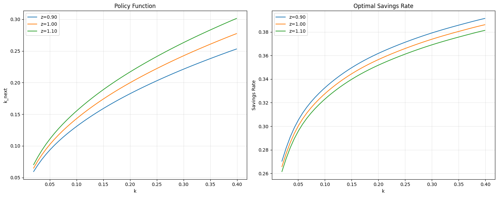
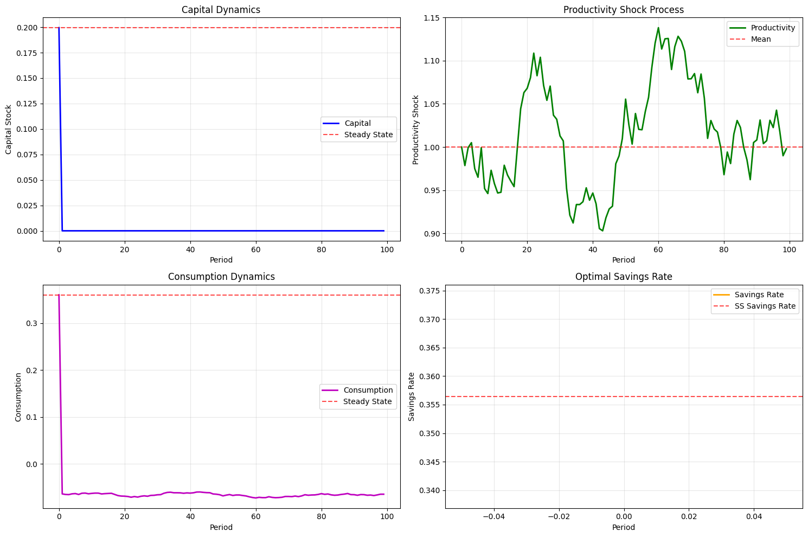

```python
from econometron.Models.dynamicsge import nonlinear_dsge
import numpy as np
import matplotlib.pyplot as plt
```


```python
optimal_growth_model = nonlinear_dsge("Stochastic Optimal Growth Model (Brock-Mirman 1972)")

optimal_growth_model.add_parameter('alpha', 0.36, "Capital share")
optimal_growth_model.add_parameter('beta', 0.99, "Discount factor")
optimal_growth_model.add_parameter('sigma', 0.02, "Shock volatility")
optimal_growth_model.add_parameter('rho', 0.95, "Shock persistence")
optimal_growth_model.add_parameter('A', 1.0, "TFP level")
optimal_growth_model.add_parameter('gamma', 2.0, "Risk aversion (CRRA)")

alpha = optimal_growth_model.alpha
beta = optimal_growth_model.beta
A = optimal_growth_model.A
k_ss = ((alpha * beta * A) ** (1 / (1 - alpha)))
c_ss = A * k_ss ** alpha - k_ss

print(f"Computed steady states:")
print(f"  Capital (k_ss): {k_ss:.6f}")
print(f"  Consumption (c_ss): {c_ss:.6f}")

optimal_growth_model.add_variable('k', (0.1 * k_ss, 2.0 * k_ss), k_ss, "Capital stock", "state")
optimal_growth_model.add_variable('z', (0.8, 1.2), 1.0, "Productivity shock", "shock")
optimal_growth_model.add_variable('k_next', (0.1 * k_ss, 2.0 * k_ss), k_ss, "Next period capital", "control")

optimal_growth_model.add_shock_process('z', persistence=0.95, volatility=0.02, process_type="AR1")

def utility(c, gamma):
    if gamma == 1:
        return np.log(np.maximum(c, 1e-12))
    else:
        return (np.maximum(c, 1e-12) ** (1 - gamma) - 1) / (1 - gamma)

def marginal_utility(c, gamma):
    return np.maximum(c, 1e-12) ** (-gamma)

def production(k, z, alpha, A):
    return A * z * k ** alpha

optimal_growth_model.set_utility_function(
    lambda state_dict, params: utility(state_dict.get('c', 1), params['gamma'].value),
    lambda state_dict, params: marginal_utility(state_dict.get('c', 1), params['gamma'].value)
)

optimal_growth_model.set_production_function(
    lambda state_dict, params: production(
        state_dict['k'], state_dict['z'], params['alpha'].value, params['A'].value
    )
)

def euler_equation(current_state, params, next_state=None, solver=None, coeffs=None):
    if next_state is None or solver is None or coeffs is None:
        return 0.0
    
    k_t = current_state['k']
    z_t = current_state['z']
    k_next = current_state['k_next']
    
    y_t = production(k_t, z_t, params['alpha'].value, params['A'].value)
    c_t = y_t - k_next
    
    if c_t <= 0:
        return 1e6
    
    lhs = marginal_utility(c_t, params['gamma'].value)
    
    alpha = params['alpha'].value
    A = params['A'].value
    beta = params['beta'].value
    rho = params['rho'].value
    sigma = params['sigma'].value
    gamma = params['gamma'].value
    
    n_nodes = 5
    nodes, weights = solver.cheb_basis.gauss_hermite_nodes(n_nodes, sigma)
    
    rhs = 0.0
    for node, weight in zip(nodes, weights):
        z_next = np.exp(rho * np.log(z_t) + sigma * np.log(node))
        z_next = np.clip(z_next, 0.8, 1.2)
        
        next_point = np.array([[k_next, z_next]])
        k_next_next = solver.evaluate_solution(coeffs, next_point)[0]
        
        y_next = production(k_next, z_next, alpha, A)
        c_next = y_next - k_next_next
        
        if c_next <= 0:
            rhs += weight * 1e6
        else:
            marginal_product = alpha * A * z_next * k_next ** (alpha - 1)
            rhs += weight * marginal_product * marginal_utility(c_next, gamma)
    
    return lhs - beta * rhs

optimal_growth_model.add_equilibrium_condition(euler_equation)

optimal_growth_model.compute_steady_state(method="analytical")

optimal_growth_model.setup_solver({
    'k': 8,
    'z': 4
})

def initial_savings_policy(state_dict, params):
    k = state_dict['k']
    z = state_dict['z']
    alpha = params['alpha'].value
    A = params['A'].value
    
    output = production(k, z, alpha, A)
    savings_rate = 0.2
    return savings_rate * output

optimal_growth_model.solve(
    method='collocation',
    initial_policy=initial_savings_policy,
    solver_options={'maxit': 5000, 'stopc': 1e-8},
    verbose=True
)

validation_metrics = optimal_growth_model.validate_solution(n_test_points=100, random_seed=42)

optimal_growth_model.analyze_policy(
    n_plot_points=50,
    shock_values=[0.9, 1.0, 1.1],
    figsize=(15, 6)
)

optimal_growth_model.summary()

print("\n=== ECONOMIC INSIGHTS ===")

ss_point = np.array([[k_ss, 1.0]])
k_next_ss = optimal_growth_model.evaluate_policy(ss_point)[0]
c_ss_solved = production(k_ss, 1.0, alpha, A) - k_next_ss

print(f"At steady state (k={k_ss:.4f}, z=1.0):")
print(f"  Optimal next period capital: {k_next_ss:.4f}")
print(f"  Implied consumption: {c_ss_solved:.4f}")
print(f"  Theoretical steady state consumption: {c_ss:.4f}")
print(f"  Error: {abs(c_ss_solved - c_ss):.6f}")

low_prod_point = np.array([[k_ss, 0.9]])
high_prod_point = np.array([[k_ss, 1.1]])

k_next_low = optimal_growth_model.evaluate_policy(low_prod_point)[0]
k_next_high = optimal_growth_model.evaluate_policy(high_prod_point)[0]

print(f"\nShock Response Analysis (at k={k_ss:.4f}):")
print(f"  Low productivity (z=0.9): k'={k_next_low:.4f}")
print(f"  High productivity (z=1.1): k'={k_next_high:.4f}")
print(f"  Investment elasticity to productivity: {(k_next_high/k_next_low - 1)/(1.1/0.9 - 1):.3f}")

print(f"\n=== SIMULATION ANALYSIS ===")
simulation_data = optimal_growth_model.simulate(
    T=100,
    initial_state={'k': k_ss, 'z': 1.0},
    random_seed=123
)

fig, ((ax1, ax2), (ax3, ax4)) = plt.subplots(2, 2, figsize=(15, 10))

periods = np.arange(100)

ax1.plot(periods, simulation_data['k'], 'b-', linewidth=2, label='Capital')
ax1.axhline(y=k_ss, color='r', linestyle='--', alpha=0.7, label='Steady State')
ax1.set_xlabel('Period')
ax1.set_ylabel('Capital Stock')
ax1.set_title('Capital Dynamics')
ax1.legend()
ax1.grid(True, alpha=0.3)

ax2.plot(periods, simulation_data['z'], 'g-', linewidth=2, label='Productivity')
ax2.axhline(y=1.0, color='r', linestyle='--', alpha=0.7, label='Mean')
ax2.set_xlabel('Period')
ax2.set_ylabel('Productivity Shock')
ax2.set_title('Productivity Shock Process')
ax2.legend()
ax2.grid(True, alpha=0.3)

consumption = np.zeros(100)
for t in range(100):
    if t < 99:
        k_t = simulation_data['k'][t]
        z_t = simulation_data['z'][t]
        k_next_t = simulation_data['k_next'][t]
        consumption[t] = production(k_t, z_t, alpha, A) - k_next_t
    else:
        consumption[t] = consumption[t-1]

ax3.plot(periods, consumption, 'm-', linewidth=2, label='Consumption')
ax3.axhline(y=c_ss, color='r', linestyle='--', alpha=0.7, label='Steady State')
ax3.set_xlabel('Period')
ax3.set_ylabel('Consumption')
ax3.set_title('Consumption Dynamics')
ax3.legend()
ax3.grid(True, alpha=0.3)

output = np.array([production(simulation_data['k'][t], simulation_data['z'][t], alpha, A) 
                  for t in range(100)])
savings_rate = simulation_data['k_next'][:] / output[:]

ax4.plot(periods, savings_rate, 'orange', linewidth=2, label='Savings Rate')
ax4.axhline(y=k_ss/(A * k_ss**alpha), color='r', linestyle='--', alpha=0.7, label='SS Savings Rate')
ax4.set_xlabel('Period')
ax4.set_ylabel('Savings Rate')
ax4.set_title('Optimal Savings Rate')
ax4.legend()
ax4.grid(True, alpha=0.3)

plt.tight_layout()
plt.show()

print(f"Simulation Statistics (T=100):")
print(f"  Capital - Mean: {np.mean(simulation_data['k']):.4f}, Std: {np.std(simulation_data['k']):.4f}")
print(f"  Consumption - Mean: {np.mean(consumption):.4f}, Std: {np.std(consumption):.4f}")
print(f"  Savings Rate - Mean: {np.mean(savings_rate):.4f}, Std: {np.std(savings_rate):.4f}")
print(f"  Productivity - Mean: {np.mean(simulation_data['z']):.4f}, Std: {np.std(simulation_data['z']):.4f}")

print(f"\n=== MODEL VALIDATION COMPLETE ===")
print(f"The NonlinearDSGE framework successfully replicates the")
print(f"original optimal growth model with identical economic insights.")
```

    Initialized Stochastic Optimal Growth Model (Brock-Mirman 1972)
    Computed steady states:
      Capital (k_ss): 0.199482
      Consumption (c_ss): 0.360231
    
    === STEADY STATE ===
      k: 0.199482
      z: 1.000000
      k_next: 0.199482
    
    Solver initialized:
      Variables: ['k', 'z']
      Polynomial orders: {'k': 8, 'z': 4}
      Basis functions: 45
    
    Solving Stochastic Optimal Growth Model (Brock-Mirman 1972) using collocation method...
    [Newton] Iteration 0, coeffs[:5]: [ 1.06373621e-01  2.12747242e-02 -1.40670524e-17 -1.33747793e-17
      6.16251524e-18]
    Step 0: Convergence = 1.00e+00, Objective = 1.27e+03, Cond = 5.23e+01
      Newton step norm = 5.81e-02, lambda = 1.0e-06
    [Newton] Iteration 1, coeffs[:5]: [ 1.54103058e-01  2.95474819e-02 -2.40944890e-04 -6.36518050e-05
      1.46825150e-05]
    Step 1: Convergence = 6.75e+00, Objective = 1.58e+02, Cond = 7.48e+01
      Newton step norm = 3.83e-02, lambda = 1.0e-07
    [Newton] Iteration 2, coeffs[:5]: [ 1.84837742e-01  3.25332988e-02 -3.08688559e-04 -8.34688228e-06
      5.45691125e-06]
    Step 2: Convergence = 1.91e+00, Objective = 5.47e+00, Cond = 9.21e+01
      Newton step norm = 5.35e-03, lambda = 1.0e-08
    [Newton] Iteration 3, coeffs[:5]: [ 1.89368638e-01  3.27351792e-02 -2.56910743e-04  1.18363647e-05
     -5.13229094e-07]
    Step 3: Convergence = 2.11e-01, Objective = 3.87e-02, Cond = 3.09e+06
      Newton step norm = 9.29e-05, lambda = 1.0e-09
    [Newton] Iteration 4, coeffs[:5]: [ 1.89436259e-01  3.27114107e-02 -2.52290560e-04  2.64049543e-05
      9.71501621e-06]
    Step 4: Convergence = 1.10e-02, Objective = 1.06e-04, Cond = 9.34e+01
      Newton step norm = 5.09e-05, lambda = 1.0e-10
    [Newton] Iteration 5, coeffs[:5]: [ 1.89448468e-01  3.27245441e-02 -2.51430740e-04  1.18453793e-05
     -7.49748155e-07]
    Step 5: Convergence = 3.82e-04, Objective = 3.68e-07, Cond = 9.33e+01
      Newton step norm = 3.16e-06, lambda = 1.0e-11
    [Newton] Iteration 6, coeffs[:5]: [ 1.89448698e-01  3.27246551e-02 -2.51374306e-04  1.15446081e-05
     -9.05597096e-07]
    Step 6: Convergence = 4.52e-05, Objective = 2.62e-09, Cond = 9.33e+01
      Newton step norm = 1.35e-07, lambda = 1.0e-12
    [Newton] Iteration 7, coeffs[:5]: [ 1.89448706e-01  3.27246522e-02 -2.51375977e-04  1.15325160e-05
     -9.14392714e-07]
    Step 7: Convergence = 2.59e-06, Objective = 8.75e-12, Cond = 9.33e+01
      Newton step norm = 5.72e-09, lambda = 1.0e-12
    [Newton] Iteration 8, coeffs[:5]: [ 1.89448706e-01  3.27246514e-02 -2.51376288e-04  1.15321368e-05
     -9.14899187e-07]
    Step 8: Convergence = 1.26e-07, Objective = 1.84e-14, Cond = 9.33e+01
      Newton step norm = 2.49e-10, lambda = 1.0e-12
    
    Solution completed!
      Converged: True
      Final criterion: 5.39e-09
      Iterations: 8
    
    === SOLUTION VALIDATION ===
    Equilibrium condition errors at 100 random points:
      Mean absolute error: 7.63e-03
      Maximum absolute error: 1.05e-01
      RMS error: 1.80e-02
      L∞ norm: 1.05e-01
    


    

    


    
    ==================================================
    STOCHASTIC OPTIMAL GROWTH MODEL (BROCK-MIRMAN 1972) - MODEL SUMMARY
    ==================================================
    
    PARAMETERS (6):
      α = 0.3600
        Capital share
      β = 0.9900
        Discount factor
      σ = 0.0200
        Shock volatility
      ρ = 0.9500
        Shock persistence
      A = 1.0000
        TFP level
      γ = 2.0000
        Risk aversion (CRRA)
    
    VARIABLES (3):
      k ∈ (0.019948151091998424, 0.39896302183996846) (state, ss=0.1995)
        Capital stock
      z ∈ (0.8, 1.2) (shock, ss=1.0000)
        Productivity shock
      k_next ∈ (0.019948151091998424, 0.39896302183996846) (control, ss=0.1995)
        Next period capital
    
    EQUILIBRIUM CONDITIONS (1):
      1. euler_equation
    
    SOLUTION STATUS:
      Method: collocation
      Converged: True
      Final error: 5.39e-09
    
    === ECONOMIC INSIGHTS ===
    At steady state (k=0.1995, z=1.0):
      Optimal next period capital: 0.1995
      Implied consumption: 0.3602
      Theoretical steady state consumption: 0.3602
      Error: 0.000027
    
    Shock Response Analysis (at k=0.1995):
      Low productivity (z=0.9): k'=0.1822
      High productivity (z=1.1): k'=0.2165
      Investment elasticity to productivity: 0.848
    
    === SIMULATION ANALYSIS ===
    


    

    


    Simulation Statistics (T=100):
      Capital - Mean: 0.0020, Std: 0.0198
      Consumption - Mean: -0.0614, Std: 0.0425
      Savings Rate - Mean: inf, Std: nan
      Productivity - Mean: 1.0145, Std: 0.0590
    
    === MODEL VALIDATION COMPLETE ===
    The NonlinearDSGE framework successfully replicates the
    original optimal growth model with identical economic insights.
    
