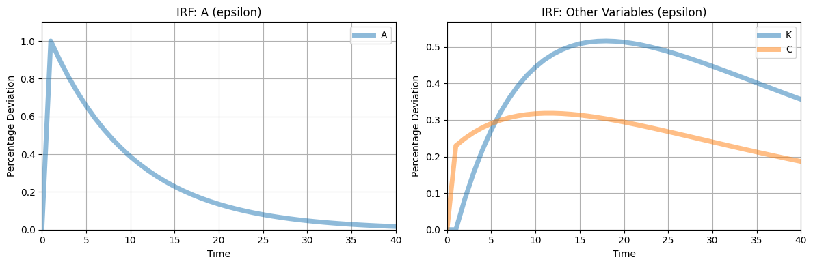
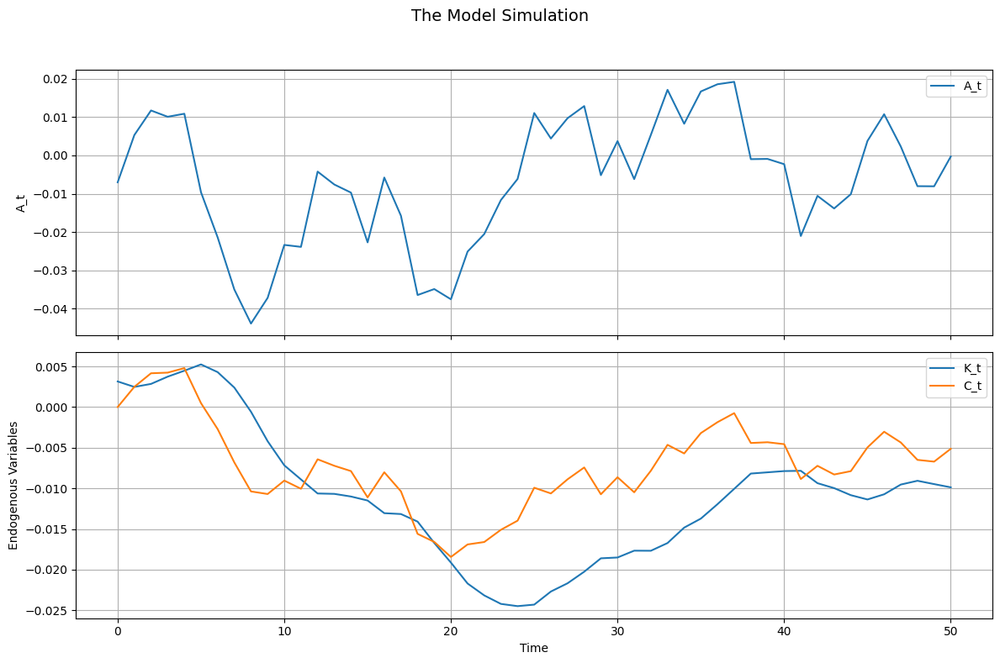

```python

from econometron.Models import RE_model
```


```python
# Model setup
equations = [
    "-C_t**(-sigma) + beta * C_tp1**(-sigma) * (alpha * A_tp1 * K_tp1**(alpha-1) + 1 - delta) = 0",
    "C_t + K_tp1 - A_t * K_t**alpha - (1 - delta) * K_t = 0",
    "-log(A_tp1) + rho_a * log(A_t) + epsilon = 0",
]

variables = ['A','K','C']
states = ['A','K']
exo_states = ['A']
endo_states = ['K']
shocks = ['epsilon']
parameters = {
    'sigma': 1.5,    # Risk aversion
    'beta': 0.99,    # Discount factor
    'alpha': 0.35,   # Capital share
    'delta': 0.025,  # Depreciation rate
    'rho_a': 0.9,
    'epsilon':0.01# Technology persistence
}

# Analytical steady state for initial guess
sigma, beta, alpha, delta, rho_a = parameters['sigma'], parameters['beta'], parameters['alpha'], parameters['delta'], parameters['rho_a']
initial_guess = [1,1]
```


```python
# Initialize and run model
RBC = RE_model(
    equations=equations,
    variables=variables,
    exo_states=exo_states,
    endo_states=endo_states,
    shocks=shocks,
    parameters=parameters,
)
```


```python
RBC.set_initial_guess(initial_guess)
RBC.normalize={'A':1}
RBC.compute_ss(guess=initial_guess, method='fsolve', options={'xtol': 1e-8})
```

    Steady-state residuals: [-1.77851329e-13  9.03721542e-14 -1.00000000e-02]
    Warning: Large steady-state residuals detected.
    


    A     1.000000
    K    34.398226
    C     2.589794
    dtype: float64


```python
RBC._Analytical_jacobians(debug=True) # this is normally an internal func but here u go 
```

    Reordered variables: ['A', 'K', 'C']
    linear
    Equation to variable mapping: {0: 'A', 1: 'K', 2: 'C'}
    Reordering index: [0, 1, 2]
    Equation 1: -C_t**(-sigma) + beta * C_tp1**(-sigma) * (alpha * A_tp1 * K_tp1**(alpha-1) + 1 - delta) = 0, shock_terms: 0
    0
    Equation 1, shock epsilon, derivative: 0
    Equation 2: C_t + K_tp1 - A_t * K_t**alpha - (1 - delta) * K_t = 0, shock_terms: 0
    0
    Equation 2, shock epsilon, derivative: 0
    Equation 3: -log(A_tp1) + rho_a * log(A_t) + epsilon = 0, shock_terms: epsilon
    1
    Equation 3, shock epsilon, derivative: 1
    


    (array([[-8.33790428e-03,  1.57555735e-04,  1.38972249e-01],
            [ 0.00000000e+00, -1.00000000e+00,  0.00000000e+00],
            [ 1.00000000e+00,  0.00000000e+00,  0.00000000e+00]]),
     array([[ 0.        ,  0.        ,  0.13897225],
            [-3.44974994, -1.01010101,  1.        ],
            [ 0.9       ,  0.        ,  0.        ]]),
     array([[0.],
            [0.],
            [1.]]))


```python
RBC.approximate() #uses num by default
```


    (array([[-8.33790428e-03,  1.57555735e-04,  1.38972249e-01],
            [ 0.00000000e+00, -1.00000000e+00,  0.00000000e+00],
            [ 1.00000000e+00,  0.00000000e+00,  0.00000000e+00]]),
     array([[ 0.        ,  0.        ,  0.13897225],
            [-3.44974994, -1.01010101,  1.        ],
            [ 0.9       ,  0.        ,  0.        ]]),
     array([[0.],
            [0.],
            [1.]]))


```python
RBC.solve_RE_model()
print("Policy Function (f):\n", RBC.f)
print("State Transition (p):\n", RBC.p)
```

    Policy Function (f):
     [[0.59492193 0.03861978]]
    State Transition (p):
     [[0.9        0.        ]
     [2.85482802 0.97148123]]
    


```python
RBC.plot_irfs()
```


    

    


```python
import numpy as np
import pandas as pd
```


```python
RBC.simulate(T=51, drop_first=10, covariance_matrix=np.array([[0.01**2]]))
```


<div>
<style scoped>
    .dataframe tbody tr th:only-of-type {
        vertical-align: middle;
    }

    .dataframe tbody tr th {
        vertical-align: top;
    }

    .dataframe thead th {
        text-align: right;
    }
</style>
<table border="1" class="dataframe">
  <thead>
    <tr style="text-align: right;">
      <th></th>
      <th>epsilon_t</th>
      <th>A_t</th>
      <th>K_t</th>
      <th>C_t</th>
    </tr>
  </thead>
  <tbody>
    <tr>
      <th>0</th>
      <td>-0.014781</td>
      <td>-0.007017</td>
      <td>0.003148</td>
      <td>0.000003</td>
    </tr>
    <tr>
      <th>1</th>
      <td>0.011630</td>
      <td>0.005315</td>
      <td>0.002476</td>
      <td>0.002491</td>
    </tr>
    <tr>
      <th>2</th>
      <td>0.006945</td>
      <td>0.011729</td>
      <td>0.002846</td>
      <td>0.004154</td>
    </tr>
    <tr>
      <th>3</th>
      <td>-0.000470</td>
      <td>0.010086</td>
      <td>0.003738</td>
      <td>0.004235</td>
    </tr>
    <tr>
      <th>4</th>
      <td>0.001797</td>
      <td>0.010875</td>
      <td>0.004469</td>
      <td>0.004790</td>
    </tr>
    <tr>
      <th>5</th>
      <td>-0.019408</td>
      <td>-0.009621</td>
      <td>0.005244</td>
      <td>0.000480</td>
    </tr>
    <tr>
      <th>6</th>
      <td>-0.012741</td>
      <td>-0.021399</td>
      <td>0.004296</td>
      <td>-0.002712</td>
    </tr>
    <tr>
      <th>7</th>
      <td>-0.015740</td>
      <td>-0.034999</td>
      <td>0.002397</td>
      <td>-0.006810</td>
    </tr>
    <tr>
      <th>8</th>
      <td>-0.012394</td>
      <td>-0.043893</td>
      <td>-0.000576</td>
      <td>-0.010378</td>
    </tr>
    <tr>
      <th>9</th>
      <td>0.002318</td>
      <td>-0.037186</td>
      <td>-0.004202</td>
      <td>-0.010698</td>
    </tr>
    <tr>
      <th>10</th>
      <td>0.010103</td>
      <td>-0.023364</td>
      <td>-0.007168</td>
      <td>-0.009044</td>
    </tr>
    <tr>
      <th>11</th>
      <td>-0.002850</td>
      <td>-0.023878</td>
      <td>-0.008903</td>
      <td>-0.010052</td>
    </tr>
    <tr>
      <th>12</th>
      <td>0.017261</td>
      <td>-0.004229</td>
      <td>-0.010631</td>
      <td>-0.006425</td>
    </tr>
    <tr>
      <th>13</th>
      <td>-0.003788</td>
      <td>-0.007594</td>
      <td>-0.010679</td>
      <td>-0.007222</td>
    </tr>
    <tr>
      <th>14</th>
      <td>-0.002873</td>
      <td>-0.009708</td>
      <td>-0.011004</td>
      <td>-0.007875</td>
    </tr>
    <tr>
      <th>15</th>
      <td>-0.013966</td>
      <td>-0.022703</td>
      <td>-0.011496</td>
      <td>-0.011112</td>
    </tr>
    <tr>
      <th>16</th>
      <td>0.014656</td>
      <td>-0.005777</td>
      <td>-0.013053</td>
      <td>-0.008022</td>
    </tr>
    <tr>
      <th>17</th>
      <td>-0.010549</td>
      <td>-0.015748</td>
      <td>-0.013160</td>
      <td>-0.010368</td>
    </tr>
    <tr>
      <th>18</th>
      <td>-0.022274</td>
      <td>-0.036447</td>
      <td>-0.014091</td>
      <td>-0.015601</td>
    </tr>
    <tr>
      <th>19</th>
      <td>-0.002086</td>
      <td>-0.034888</td>
      <td>-0.016714</td>
      <td>-0.016588</td>
    </tr>
    <tr>
      <th>20</th>
      <td>-0.006161</td>
      <td>-0.037560</td>
      <td>-0.019133</td>
      <td>-0.018443</td>
    </tr>
    <tr>
      <th>21</th>
      <td>0.008700</td>
      <td>-0.025104</td>
      <td>-0.021705</td>
      <td>-0.016901</td>
    </tr>
    <tr>
      <th>22</th>
      <td>0.002060</td>
      <td>-0.020534</td>
      <td>-0.023169</td>
      <td>-0.016602</td>
    </tr>
    <tr>
      <th>23</th>
      <td>0.006827</td>
      <td>-0.011654</td>
      <td>-0.024213</td>
      <td>-0.015097</td>
    </tr>
    <tr>
      <th>24</th>
      <td>0.004333</td>
      <td>-0.006156</td>
      <td>-0.024489</td>
      <td>-0.013976</td>
    </tr>
    <tr>
      <th>25</th>
      <td>0.016606</td>
      <td>0.011066</td>
      <td>-0.024302</td>
      <td>-0.009924</td>
    </tr>
    <tr>
      <th>26</th>
      <td>-0.005548</td>
      <td>0.004411</td>
      <td>-0.022690</td>
      <td>-0.010626</td>
    </tr>
    <tr>
      <th>27</th>
      <td>0.005742</td>
      <td>0.009712</td>
      <td>-0.021677</td>
      <td>-0.008888</td>
    </tr>
    <tr>
      <th>28</th>
      <td>0.004136</td>
      <td>0.012877</td>
      <td>-0.020253</td>
      <td>-0.007431</td>
    </tr>
    <tr>
      <th>29</th>
      <td>-0.016754</td>
      <td>-0.005165</td>
      <td>-0.018607</td>
      <td>-0.010731</td>
    </tr>
    <tr>
      <th>30</th>
      <td>0.008384</td>
      <td>0.003736</td>
      <td>-0.018505</td>
      <td>-0.008634</td>
    </tr>
    <tr>
      <th>31</th>
      <td>-0.009552</td>
      <td>-0.006190</td>
      <td>-0.017667</td>
      <td>-0.010484</td>
    </tr>
    <tr>
      <th>32</th>
      <td>0.010932</td>
      <td>0.005361</td>
      <td>-0.017677</td>
      <td>-0.007836</td>
    </tr>
    <tr>
      <th>33</th>
      <td>0.012299</td>
      <td>0.017123</td>
      <td>-0.016728</td>
      <td>-0.004647</td>
    </tr>
    <tr>
      <th>34</th>
      <td>-0.007148</td>
      <td>0.008263</td>
      <td>-0.014830</td>
      <td>-0.005709</td>
    </tr>
    <tr>
      <th>35</th>
      <td>0.009256</td>
      <td>0.016694</td>
      <td>-0.013721</td>
      <td>-0.003203</td>
    </tr>
    <tr>
      <th>36</th>
      <td>0.003552</td>
      <td>0.018576</td>
      <td>-0.011944</td>
      <td>-0.001860</td>
    </tr>
    <tr>
      <th>37</th>
      <td>0.002487</td>
      <td>0.019205</td>
      <td>-0.010062</td>
      <td>-0.000749</td>
    </tr>
    <tr>
      <th>38</th>
      <td>-0.018263</td>
      <td>-0.000978</td>
      <td>-0.008181</td>
      <td>-0.004421</td>
    </tr>
    <tr>
      <th>39</th>
      <td>-0.000036</td>
      <td>-0.000916</td>
      <td>-0.008029</td>
      <td>-0.004329</td>
    </tr>
    <tr>
      <th>40</th>
      <td>-0.001461</td>
      <td>-0.002286</td>
      <td>-0.007876</td>
      <td>-0.004565</td>
    </tr>
    <tr>
      <th>41</th>
      <td>-0.018979</td>
      <td>-0.021036</td>
      <td>-0.007841</td>
      <td>-0.008854</td>
    </tr>
    <tr>
      <th>42</th>
      <td>0.008372</td>
      <td>-0.010560</td>
      <td>-0.009363</td>
      <td>-0.007229</td>
    </tr>
    <tr>
      <th>43</th>
      <td>-0.004344</td>
      <td>-0.013848</td>
      <td>-0.009973</td>
      <td>-0.008297</td>
    </tr>
    <tr>
      <th>44</th>
      <td>0.002333</td>
      <td>-0.010130</td>
      <td>-0.010837</td>
      <td>-0.007886</td>
    </tr>
    <tr>
      <th>45</th>
      <td>0.012895</td>
      <td>0.003777</td>
      <td>-0.011369</td>
      <td>-0.004964</td>
    </tr>
    <tr>
      <th>46</th>
      <td>0.007348</td>
      <td>0.010747</td>
      <td>-0.010731</td>
      <td>-0.003036</td>
    </tr>
    <tr>
      <th>47</th>
      <td>-0.007351</td>
      <td>0.002322</td>
      <td>-0.009533</td>
      <td>-0.004357</td>
    </tr>
    <tr>
      <th>48</th>
      <td>-0.010121</td>
      <td>-0.008031</td>
      <td>-0.009069</td>
      <td>-0.006497</td>
    </tr>
    <tr>
      <th>49</th>
      <td>-0.000835</td>
      <td>-0.008063</td>
      <td>-0.009477</td>
      <td>-0.006713</td>
    </tr>
    <tr>
      <th>50</th>
      <td>0.006960</td>
      <td>-0.000297</td>
      <td>-0.009876</td>
      <td>-0.005134</td>
    </tr>
  </tbody>
</table>
</div>


```python
RBC.simulations()
```


    

    

